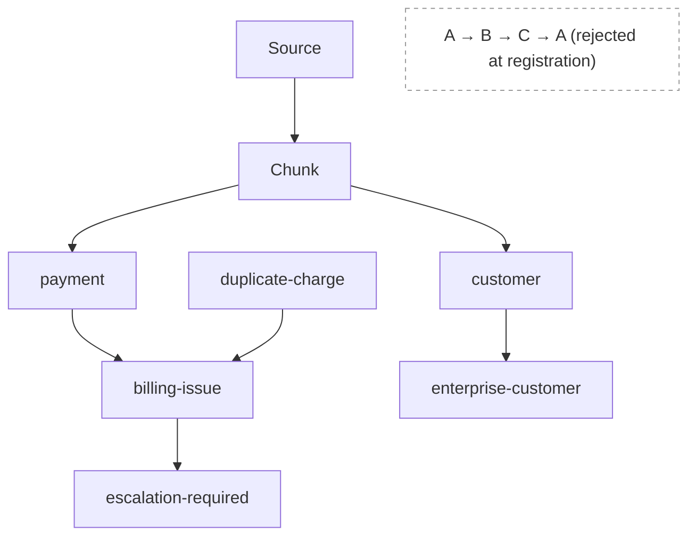

# Annotation Dependencies

## What it is

The annotation dependency graph is the architectural subsystem that stores, validates and walks the explicit
derivation edges between [annotation definitions](../concepts/annotations.md) — the directed acyclic graph
that [Resolutor](resolutor.md) queries to compute exactly what became stale after a change, so
[Equalix](equalix.md) recalculates only that, never the whole knowledge base.

## Why it exists

Some annotations are cheap to detect directly from a chunk. Others are only meaningful as a composition of
simpler ones — a `billing-issue` annotation is `payment` plus `duplicate-charge`; an `escalation-required`
annotation is derived from `billing-issue`. Without an explicit, stored graph of those relationships, the
platform has two bad options when `payment-detection` changes from v3 to v4: recalculate everything,
"to be safe," or recalculate nothing and silently leave `billing-issue` and `escalation-required` stale.
Neither is acceptable at enterprise scale.

The graph is deliberately kept separate from [taxonomy](../concepts/taxonomy.md):

> **Taxonomy describes meaning. Dependency describes derivation.**

A taxonomy hierarchy — `payment` under `billing` under `support` — is authored for human navigation and
reporting. It must never be silently treated as a processing dependency; that conflation produces either far
too much unnecessary recalculation or missed invalidation, and the platform enforces the distinction
structurally rather than relying on convention.

## How it works

Each [annotation definition](../concepts/annotations.md#annotation-definitions) declares, at registration
time, which other annotation types or definitions it consumes as input. The platform assembles those
declarations into a single dependency graph and validates it as a **directed acyclic graph**: `A → B → C` is
accepted, but `A → B → C → A` is rejected outright, at registration, before it can ever cause an unbounded
recalculation loop. Cycle detection happens once, when a definition is published — not discovered later,
mid-recalculation, as a production incident.

The graph determines which downstream artifacts *may* become stale after a change; it does not itself decide
whether they *will* be recalculated now, later, or at all — that is [Resolutor](resolutor.md)'s and
[Equalix](equalix.md)'s job.

## Example

`payment-detection` is republished as version 4. The dependency graph shows one direct dependent,
`billing-issue`, and one transitive dependent, `escalation-required`. [Resolutor](resolutor.md) walks the
graph from every `payment` annotation produced under the old version and returns the exact affected set:
every `billing-issue` derived from one of those `payment` annotations, and every `escalation-required`
derived from one of those `billing-issue` annotations — while a completely unrelated branch, `customer` →
`enterprise-customer`, is left untouched because nothing in it declared a dependency on `payment`.

## Inputs

- [Annotation definitions](../concepts/annotations.md) declaring their input annotation types or definition
  IDs at registration time.
- A change event — a new definition version, a model/rule/dictionary update, or a source or chunking change
  propagated from the [Change Matrix](recalculation.md#change-matrix).

## Outputs

- A validated directed acyclic graph of dependency edges, queryable in both directions ("what does this
  depend on" and "what depends on this").
- An **impact set** — the transitive closure of dependents reachable from a changed node — handed to
  [Resolutor](resolutor.md) as the basis for a recalculation plan.

## Transformations

Registration-time cycle detection: a proposed new edge is rejected if it would close a cycle in the existing
graph. At change time, a graph walk from the changed node produces the transitive closure of affected
dependents — the graph itself is not transformed by this walk, only read.

## Dependencies

Built directly on the [Annotation Plane](annotation-plane.md) and the identity of the definitions it
registers. Consumed by [Resolutor](resolutor.md) for impact analysis and by [Equalix](equalix.md), which
schedules the resulting recalculation jobs under priority and resource controls so background recalculation
never starves incremental or interactive work. Underlies [Recalculation](recalculation.md) end to end.

## Change and recalculation

This graph is the mechanism that makes dependency-aware recalculation possible at all. A change to one
annotation definition — a rule, a model version, a dictionary — only ever triggers recalculation of the
definitions that explicitly declared a dependency on it. See the [Change Impact Model](recalculation.md#change-matrix)
for how this interacts with extraction, chunking, indexing and analytics changes, and
[Security Reclassification](recalculation.md) for how a classification change propagates through the same
graph.

## Security

Dependency edges carry no security classification of their own, but a derived annotation must never expose
information from an input annotation or chunk it was not authorized to see. A `billing-issue` derived from a
masked `payment` annotation must itself respect that masking — see
[Security-Aware Search](../concepts/security-aware-search.md).

## Lineage

Every derived annotation's dependency edges are part of its [provenance](../concepts/provenance.md) record —
"why does this annotation exist" includes "which other annotations, at which versions, it was derived from."
The dependency graph is what makes that chain queryable rather than merely asserted.

## Related concepts

[Annotation Dependencies (concept)](../concepts/annotation-dependencies.md) ·
[Taxonomy vs Dependency](../concepts/taxonomy.md) · [Provenance](../concepts/provenance.md) ·
[Annotation Plane](annotation-plane.md) · [Resolutor](resolutor.md) · [Equalix](equalix.md)
