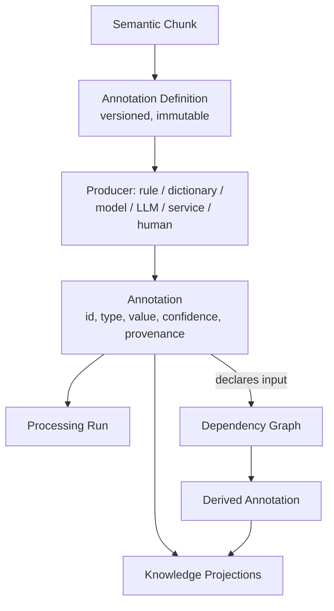

# Annotation Plane

## What it is

The Annotation Plane is the layer of the architecture that turns [semantic chunks](content-model.md) into
first-class knowledge. It is where [annotation definitions](../concepts/annotations.md) are registered,
producers (rule engines, dictionaries, ML models, LLMs, external services, custom code, human operators) run
against chunks and against other annotations, and every resulting annotation is given a stable identity,
provenance, and a place in the platform's [dependency graph](annotation-dependencies.md).

## Why it exists

Before this plane existed, annotations were ad hoc outputs of whatever rule, model or script produced them —
no versioned identity, no explicit dependency graph, no controlled way to recalculate them when a rule,
model, dictionary, source or policy changed. That made two things impossible: knowing exactly what to
recompute when an annotation definition changed, and explaining, after the fact, why a given annotation
exists at all.

> **Extraction describes what content contains. Annotation describes what Synanton understands about it.**

The Annotation Plane exists to make annotations independently addressable, versioned and explainable — so a
classification rule can change and be re-run without re-parsing a single source document, and so every
derived annotation can answer "why does this exist?" on demand.

## How it works



An [annotation definition](../concepts/annotations.md) declares what it produces and, if it derives from
other annotations rather than directly from a chunk, which ones it consumes — that declaration is what
populates the [annotation dependency graph](annotation-dependencies.md). Definitions are immutable once
published; a changed rule or model registers as a new definition version rather than mutating the old one,
so multiple versions of an interpretation can coexist and be compared.

### Annotation identity

Every annotation carries identity independent of who produced it:

```text
annotation_id
definition_id / definition_version
annotation_type, namespace, name
target_type, target_id
value
producer, producer_version
confidence
provenance
processing_run_id
created_at / invalidated_at
```

### Processing runs

Every substantial annotation operation belongs to a **processing run** — the unit that groups execution
context: producer, producer version, configuration, input scope, start/end time, status, affected objects,
errors, and resource consumption. Processing runs are permanent provenance objects, retained under policy,
because they are what lets an auditor reconstruct exactly what happened, when, and at what scale.

## Example

The `payment-detection` definition, version 4, runs against invoice chunk `18291` and produces a `payment`
annotation at confidence 0.94, grouped under processing run `run-2026-00182`. Because the `billing-issue`
definition declares `payment` and `duplicate-charge` as inputs, a `billing-issue` annotation can be derived
compositionally — without `billing-issue` ever touching the raw invoice text itself.

## Inputs

- [Semantic chunks](content-model.md) — the addressable units annotations attach to.
- Other annotations — for definitions that derive rather than detect directly (see
  [Annotation Dependencies](annotation-dependencies.md)).
- [Annotation definitions](../concepts/annotations.md): versioned, immutable specifications of what a
  producer produces and what it consumes.

## Outputs

- Versioned [annotation](../concepts/annotations.md) records, typed as Tag, Classification, Entity,
  Attribute or Signal — see [Annotation Types](../concepts/annotation-types.md).
- Dependency edges consumed by [Resolutor](resolutor.md) for impact analysis.
- Processing run records that anchor [provenance](../concepts/provenance.md).

## Transformations

Chunk content (or an upstream annotation's value) plus a definition's producer logic becomes an annotation
value. The annotation itself does not transform further once created — a changed interpretation produces a
new annotation version through a new processing run, it never mutates the existing record in place.

## Dependencies

The Annotation Plane depends on [Semantic Chunking](content-model.md) for stable target identity, and on the
[Annotation Dependency Graph](annotation-dependencies.md) for compositional annotations. It feeds
[Resolutor](resolutor.md) and [Equalix](equalix.md) for [recalculation](recalculation.md), and
[Knowledge Projections](knowledge-projections.md) for search and analytics. Durable persistence of a
derived-annotation write — so a producer's committed output is never silently lost between computation and
storage — is a Commitix-guaranteed execution intent; the Annotation Plane relies on that contract without
depending on how any particular producer implements it.

## Change and recalculation

Changing an annotation definition's rule, model or dictionary version does not touch existing annotation
records; it registers a new definition version and marks every annotation produced under the old version as
a candidate for recalculation. [Resolutor](resolutor.md) computes the exact affected set from the dependency
graph, and [Equalix](equalix.md) executes that recalculation without starving interactive workloads. See the
[Change Matrix](recalculation.md#change-matrix) for the full impact model across extraction, chunking,
annotation, indexing and analytics.

## Security

An annotation on a classified chunk inherits and must respect that chunk's classification and representation
— an annotation must never expose an unmasked value that the underlying chunk would not itself expose to the
same viewer. Classification-type annotations carry authorization consequences that other types do not; see
[Security Classification](../concepts/security-classification.md).

## Lineage

Every annotation's provenance — producer, producer version, definition, definition version, evidence,
confidence, source, target, processing run, dependencies, creation time, lifecycle — is what lets a reviewer
answer "why does this annotation exist?" See [Provenance](../concepts/provenance.md) for the full chain from
source through report.

## Related concepts

[Annotations](../concepts/annotations.md) · [Annotation Types](../concepts/annotation-types.md) ·
[Annotation Dependencies](../concepts/annotation-dependencies.md) ·
[Taxonomy vs Dependency](../concepts/taxonomy.md) · [Provenance](../concepts/provenance.md)
