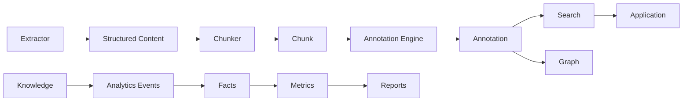

# Contracts

## What it is

A contract is the specification of a stable boundary between two stages of the pipeline: the exact shape a
producing stage promises to emit, and the guarantees a consuming stage can rely on — independent of which
technology implements either side. This page documents the specific contracts that hold the architecture
together; see [Contracts (concept)](../concepts/contracts.md) for why the platform is built this way at all.

## Why it exists

Synanton's [Polyglot Architecture](polyglot-architecture.md) only works if the boundaries between
differently-implemented modules are stable enough that either side can be reimplemented, rewritten, or
swapped for a different technology without the other side noticing. A contract is what makes a boundary
stable enough to build on: it turns "whatever this service currently returns" into "a specification both
sides can be tested against independently."

## How it works



The stable contracts that carry the architecture end to end:

```text
Extractor         → Structured Content
Chunker            → Chunk
Annotation Engine  → Annotation
Annotation         → Search
Annotation         → Graph
Knowledge          → Analytics Events
Analytics Events   → Facts
Facts              → Metrics
Metrics            → Reports
Search             → Application
```

Each contract is versioned explicitly. A conforming implementation on either side can change entirely — a
different language, a different service, a different team — as long as it continues to satisfy the same
version of the contract, verified by tests that run against both sides independently rather than by
inspecting either implementation's internals.

## Example

The extraction contract is versioned as `synanton.extraction.v1` and mirrored byte-for-byte between the core
platform and whatever service implements extraction today — verified automatically so the two definitions
can never silently drift apart. Because the contract, not the implementation, is what [Chunking](semantic-chunking.md)
depends on, the extraction service can be replaced or rewritten in a different stack without the chunker
changing at all.

## Inputs

An explicit specification per boundary: message or schema shape, required fields, a versioning rule, and
defined failure semantics — authored once, before either side is built or rebuilt against it.

## Outputs

Two independently-evolvable implementations — producer and consumer — that both certify against the same
contract tests, and a downstream stage that can trust the contract's guarantees without knowing anything
about how the upstream side is actually built.

## Transformations

None — a contract specifies a boundary; it doesn't transform data itself. The transformations happen inside
each implementation (see [Extraction Plane](extraction-plane.md), [Semantic Chunking](semantic-chunking.md),
[Annotation Plane](annotation-plane.md), and the [Knowledge Projections](knowledge-projections.md) that
consume the annotation contracts).

## Dependencies

Every stage in the [architecture overview](overview.md)'s pipeline is defined against one of these
contracts rather than against a specific implementation. [Knowledge Projections](knowledge-projections.md),
[Analytics Events](analytics-events.md), and the [Search](search-architecture.md) surface all consume — and
are only allowed to consume — the contract's guaranteed shape, never an implementation detail that happens
to be true today.

## Change and recalculation

A contract version change is a breaking change by definition: it requires an explicit migration path (a
deprecation window, a dual-write or dual-read period) rather than a silent cutover, because consumers were
built against the old shape. An implementation change behind an *unchanged* contract version requires no
downstream changes at all — that asymmetry is the entire point of drawing the boundary where the contract
is.

## Security

Security-relevant contracts — classification and representation, in particular — are normative, not
advisory: every implementation on either side of those boundaries must honor them exactly, because a
partial or approximate implementation of a security-critical contract reintroduces exactly the risk the
contract exists to remove. See [Design 1.23](../design/synanton-design-1.23.md) for the normative detail.

## Lineage

The contract version that produced an artifact is recorded as part of that artifact's provenance — knowing
that a chunk was produced under extraction contract `v1`, for instance, is part of explaining that chunk
later, especially across a migration where two contract versions were briefly in force at once.

## Related concepts

[Contracts (concept)](../concepts/contracts.md) · [Polyglot Architecture](polyglot-architecture.md) ·
[Extraction Plane](extraction-plane.md) · [Annotation Plane](annotation-plane.md) ·
[Knowledge Projections](knowledge-projections.md)
