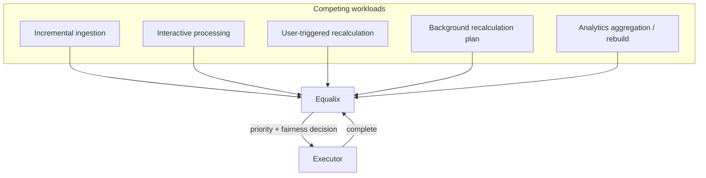

# Equalix

## What it is

Equalix controls execution. Given the competing demands of incremental ingestion, interactive processing,
user-triggered recalculation, background recalculation and analytics aggregation or rebuild, Equalix decides
**what runs next** — so that background knowledge and analytics maintenance never starves incremental and
interactive workloads.

## Why it exists

[Resolutor](resolutor.md) can legitimately produce a large recalculation plan — an embedding model upgrade,
for instance, can affect a large share of a tenant's vectors. If that plan simply ran, unconstrained, it
would compete for the same execution capacity as live search and incoming documents, and interactive users
would feel it as latency. Equalix exists so that *what needs to happen* (Resolutor's job) and *when it's
safe to happen* (Equalix's job) are separate decisions — background maintenance stays possible without ever
being allowed to degrade the workloads people are actively waiting on.

## How it works

Equalix sits in front of a rate-limited executor and orders competing work by priority and fairness rather
than by arrival order or a fixed static schedule. The reference implementation is an **eventually-fair
scheduler**: each unit of work carries a fairness key (typically a tenant), and priority is computed from a
virtual clock plus an estimate of how much of that key's work is already in flight — busy keys are pushed
back, and a configurable weight lets some keys claim a larger share of capacity than others. Completions
feed back into the estimate, so the schedule adapts as work finishes rather than following a plan fixed in
advance.

That mechanism is an implementation detail, not the architectural contract. What every plane of Synanton
can rely on is the principle: **background knowledge and analytics maintenance must not starve incremental
and interactive workloads.** See the `equalix` repository's own documentation for the scheduler's
implementation — virtual-time priority, Count-Min Sketch in-flight estimation, and
`SELECT … FOR UPDATE SKIP LOCKED` dispatch against PostgreSQL.

## Example

An embedding model upgrade produces a large background recalculation plan for tenant A. Equalix schedules
that work with a lower effective priority than tenant A's own interactive searches and any tenant's
incremental ingestion — so tenant A's users keep getting fast search results, tenant B's ingestion isn't
delayed by tenant A's maintenance, and the recalculation still completes, just without ever winning a
head-to-head contest against live traffic.

## Inputs

Recalculation plans from [Resolutor](resolutor.md), incremental ingestion jobs, interactive processing
requests, user-triggered recalculation requests, and analytics aggregation or historical rebuild jobs — each
associated with a workload class and a fairness key (typically a tenant).

## Outputs

Dispatch decisions: which unit of work is executed next, under what concurrency and resource limits.
Downstream of those decisions, in aggregate, are the same updated knowledge and updated analytics that
[Recalculation](recalculation.md) produces — Equalix's own output is the *order and pace* of execution, not
the knowledge itself.

## Transformations

None to knowledge or analytics content. Equalix transforms a set of competing, unordered work requests into
an ordered, rate- and resource-constrained dispatch sequence. It does not decide what is affected by a
change — that determination has already been made by Resolutor before work reaches Equalix at all.

## Dependencies

Equalix consumes recalculation plans produced by [Resolutor](resolutor.md) as one of several input
workloads; it does not depend on Resolutor's internal dependency-graph walk, only on the plan's output. It
depends on a rate-limited executor to actually perform work, and on [Contracts](contracts.md) for the
stable interface every workload — ingestion, interactive, recalculation, analytics — submits work through.

## Change and recalculation

Equalix's own scheduling parameters — fairness weights, priority policy, concurrency limits — are an
operational and policy concern, not a knowledge change: adjusting them never triggers, and never requires,
any recalculation of stored knowledge. Conversely, when Resolutor's dependency graph changes and produces a
different plan, Equalix treats it like any other newly submitted workload; it has no special-case logic for
"the plan changed," because scheduling and impact analysis were never coupled to begin with.

## Security

Fairness keys are tenant boundaries as well as scheduling boundaries: no tenant's background maintenance
should be able to consume execution capacity at another tenant's expense, and no tenant should be starved
because another tenant submitted a much larger recalculation plan. Multi-tenant isolation applies to
workload controls the same way it applies to facts, aggregates and caches elsewhere in the platform (see
[§2.8, Operational Scalability](../design/synanton-design-1.25.md)).

## Lineage

Equalix does not itself store knowledge, so it isn't where lineage lives — but every job it dispatches
corresponds to a processing run or evaluation run that was already recorded by [Resolutor](resolutor.md) or
by the knowledge model before dispatch. Equalix's scheduling decisions (when a job ran, relative to what
else was competing for capacity) are useful operational context for that lineage, without being lineage's
authoritative source.

## Related concepts

[Resolutor](resolutor.md) · [Recalculation](recalculation.md) · [Architecture Overview](overview.md) ·
[Synanton Design 1.25](../design/synanton-design-1.25.md)
