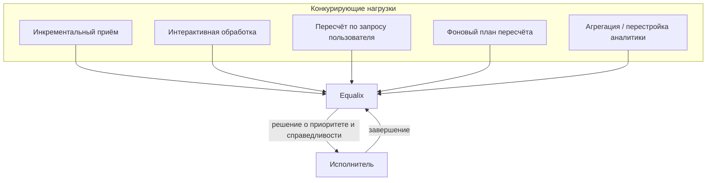

# Equalix

## Что это

Equalix управляет выполнением. Учитывая конкурирующие потребности инкрементального приёма, интерактивной
обработки, пересчёта по запросу пользователя, фонового пересчёта и агрегации или перестройки аналитики,
Equalix решает, **что выполняется следующим** — так, чтобы фоновое обслуживание знаний и аналитики никогда
не лишало ресурсов инкрементальные и интерактивные нагрузки.

## Почему это существует

[Resolutor](resolutor.ru.md) может на законных основаниях сформировать большой план пересчёта — например,
обновление модели эмбеддингов может затронуть значительную долю векторов тенанта. Если такой план просто
выполнялся бы без ограничений, он конкурировал бы за те же ресурсы выполнения, что и живой поиск и
поступающие документы, и интерактивные пользователи почувствовали бы это как задержку. Equalix существует,
чтобы *что нужно сделать* (задача Resolutor) и *когда это безопасно делать* (задача Equalix) были отдельными
решениями — фоновое обслуживание остаётся возможным, но никогда не может ухудшить нагрузки, ответа на
которые люди активно ждут.

## Как это работает

Equalix стоит перед исполнителем с ограничением скорости и упорядочивает конкурирующую работу по приоритету
и справедливости, а не по порядку поступления или фиксированному статическому расписанию. Эталонная
реализация — это **со временем справедливый (eventually-fair) планировщик**: каждая единица работы несёт
ключ справедливости (обычно тенант), а приоритет вычисляется из виртуальных часов плюс оценки того, сколько
работы этого ключа уже выполняется — занятые ключи отодвигаются назад, а настраиваемый вес позволяет одним
ключам претендовать на большую долю ресурсов, чем другим. Завершения работы возвращаются в оценку, поэтому
расписание адаптируется по мере завершения работы, а не следует плану, зафиксированному заранее.

Этот механизм — деталь реализации, а не архитектурный контракт. На что может опираться любой уровень
Synanton — это принцип: **фоновое обслуживание знаний и аналитики не должно лишать ресурсов инкрементальные
и интерактивные нагрузки.** Собственная документация репозитория `equalix` описывает реализацию
планировщика — приоритет на основе виртуального времени, оценку количества выполняющихся задач через
Count-Min Sketch и диспетчеризацию через `SELECT … FOR UPDATE SKIP LOCKED` в PostgreSQL.

## Пример

Обновление модели эмбеддингов формирует большой фоновый план пересчёта для тенанта A. Equalix планирует эту
работу с более низким эффективным приоритетом, чем собственные интерактивные запросы тенанта A и
инкрементальный приём любого тенанта — так что пользователи тенанта A продолжают получать быстрые результаты
поиска, приём тенанта B не задерживается обслуживанием тенанта A, а пересчёт всё равно завершается, просто
никогда не выигрывая прямое противостояние с живым трафиком.

## Входные данные

Планы пересчёта от [Resolutor](resolutor.ru.md), задания инкрементального приёма, запросы интерактивной
обработки, запросы пересчёта по инициативе пользователя и задания агрегации или исторической перестройки
аналитики — каждое связано с классом нагрузки и ключом справедливости (обычно тенантом).

## Выходные данные

Решения о диспетчеризации: какая единица работы выполняется следующей, с какой конкурентностью и
ограничением ресурсов. Ниже по потоку от этих решений, в совокупности, находятся те же обновлённые знания
и обновлённая аналитика, которые производит [Пересчёт](recalculation.ru.md) — собственный результат
Equalix — это *порядок и темп* выполнения, а не сами знания.

## Преобразования

Никаких — над содержимым знаний или аналитики. Equalix превращает набор конкурирующих, неупорядоченных
запросов на работу в упорядоченную последовательность диспетчеризации с ограничениями по скорости и
ресурсам. Он не решает, что затронуто изменением — это решение уже принято Resolutor до того, как работа
дошла до Equalix.

## Зависимости

Equalix потребляет планы пересчёта, произведённые [Resolutor](resolutor.ru.md), как одну из нескольких
входных нагрузок; он не зависит от внутреннего прохода Resolutor по графу зависимостей, только от
результата плана. Он зависит от исполнителя с ограничением скорости для фактического выполнения работы и
от [Контрактов](contracts.md) — стабильного интерфейса, через который каждая нагрузка (приём, интерактивная
обработка, пересчёт, аналитика) отправляет работу.

## Изменение и пересчёт

Собственные параметры планирования Equalix — веса справедливости, политика приоритетов, ограничения
конкурентности — это вопрос эксплуатации и политики, а не изменения знаний: их настройка никогда не
вызывает и никогда не требует какого-либо пересчёта сохранённых знаний. И наоборот, когда граф зависимостей
Resolutor меняется и формирует другой план, Equalix обрабатывает его как любую другую вновь поступившую
нагрузку; у него нет специальной логики на случай «план изменился», потому что планирование и анализ
влияния изначально не были связаны.

## Безопасность

Ключи справедливости — это и границы тенантов, и границы планирования: фоновое обслуживание одного тенанта
не должно потреблять ресурсы выполнения за счёт другого тенанта, и ни один тенант не должен голодать из-за
того, что другой тенант отправил намного больший план пересчёта. Многотенантная изоляция применяется к
средствам управления нагрузкой так же, как и к фактам, агрегатам и кэшам в остальной части платформы (см.
[§2.8, Операционная масштабируемость](../design/synanton-design-1.25.md)).

## Происхождение

Equalix сам не хранит знания, поэтому происхождение не живёт здесь — но каждое задание, которое он
диспетчеризует, соответствует обработочному или оценочному прогону, уже зафиксированному
[Resolutor](resolutor.ru.md) или моделью знаний до диспетчеризации. Решения Equalix о планировании (когда
задание выполнилось относительно того, с чем оно конкурировало за ресурсы) — полезный операционный контекст
для этого происхождения, но не его авторитетный источник.

## Связанные концепции

[Resolutor](resolutor.ru.md) · [Пересчёт](recalculation.ru.md) · [Обзор архитектуры](overview.ru.md) ·
[Synanton Design 1.25](../design/synanton-design-1.25.md)
