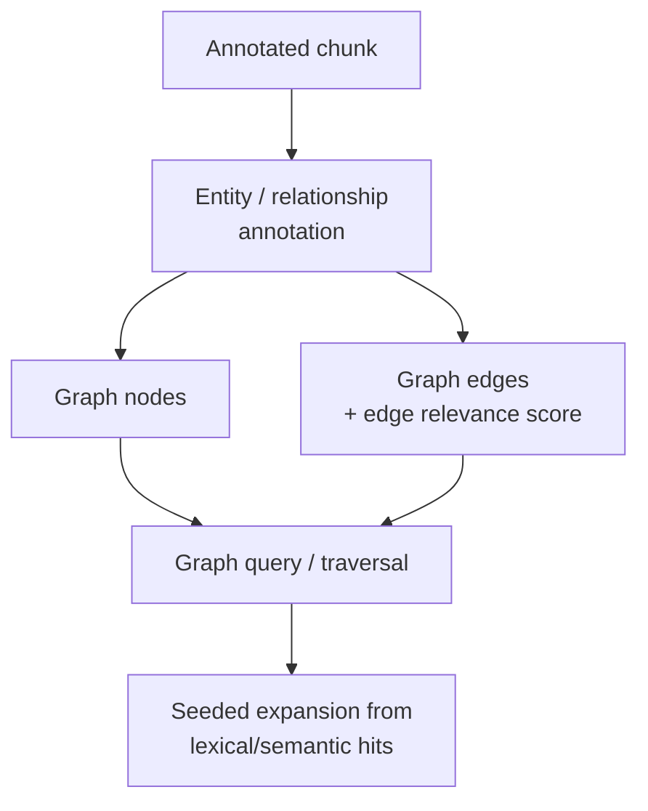

# Graph

## What it is

The graph is the relationship projection of canonical knowledge: entities and relationships mentioned across
chunks — companies, people, contracts, obligations — become nodes and edges in a knowledge graph, maintained
by `relix`, Synanton's GraphRAG engine, and queried by traversal rather than by relevance ranking.

## Why it exists

"What is connected to what" is a fundamentally different kind of question from "which passages best match
this query" — a supply chain, an ownership structure, or a policy-to-contract relationship isn't something
either the reverse index or the vector store is built to answer, because neither of them ranks by graph
structure. The graph exists to answer exactly that class of question, and to let a text-based search expand
into connected facts that neither text-based approach would surface on its own.

## How it works

Entities and relationships mentioned in a chunk are mapped onto the platform's ontology and written as nodes
and edges. Every edge carries a composite relevance score combining several signals — an explicit link
stated in the source, two entities sharing a source chunk, co-occurrence in the same enriched chunk, and
shared ontology type — so a traversal can prefer strong relationships over incidental ones. On high-degree
"supernode" entities (a company mentioned everywhere, say), traversal is bounded to edges relevant to the
current query's top candidates rather than walking every connection. A background community-detection pass
groups densely connected entities and can flag sparsely connected clusters as knowledge gaps worth
reviewing.

Graph queries most often run as a **second step**, seeded by the top candidates from lexical/semantic
fusion — see [Search 101's GraphRAG description](../guides/overviews/search.md) — rather than as the
first and only lens on a query, because graph traversal answers "what's connected" and doesn't itself rank
text by relevance.

## Example

A search for a vendor's delivery obligations returns a clause via lexical and semantic search; the vendor
entity in that clause seeds a graph traversal that surfaces a related fact from a *different* document — an
amendment filed six months later that changed the penalty terms for that same vendor relationship. Neither
the reverse index nor the vector store would have found that connection on its own, because it isn't a
textual match at all — it's a graph fact.

## Inputs

Annotated chunks carrying entity and relationship annotations, plus the platform's ontology used to map
mentions onto graph node and edge types.

## Outputs

Graph nodes and edges, each tied back to the chunk(s) that contributed them, each edge carrying a composite
relevance score and, periodically, a community identifier from background clustering.

## Transformations

Entity resolution and mapping to the ontology, edge relevance scoring from multiple weighted signals, and
(as a background job, not per-query) community detection over the full entity graph.

## Dependencies

Depends on the [Annotation Plane](annotation-plane.md)'s entity and relationship extraction, and on the
platform ontology being stable enough that entity mappings don't silently drift. Frequently-traversed
patterns depend on a materialized, incrementally-refreshed view rather than live traversal for latency —
that view falls back transparently to live traversal if its refresh falls behind.

## Change and recalculation

An ontology change or a new source overlap between entities triggers incremental edge-relevance recomputation
and materialized-view refresh scoped to the affected community of entities, not a whole-graph rebuild — see
the [change impact model](recalculation.md#change-impact-model). Because a graph node can be contributed to
by multiple source chunks, deleting a single contributing document reduces a node's reference count rather
than deleting the entity outright — the entity is only removed once no source chunk contributes to it any
longer.

## Security

Traversal is access-controlled the same way search is: a query only follows edges and nodes the caller is
authorized to see, and a chunk with a masked and an original representation contributes correspondingly
masked or original node/edge detail depending on who's querying. A graph fact is exactly as protected as the
chunk it was extracted from — traversal never becomes a side channel around a classification a direct search
would have respected.

## Lineage

Every node and edge retains a reference to the chunk(s) it was extracted from, and a reference count of how
many chunks currently contribute to it — the mechanism that lets deletion of one source document be
distinguished from deletion of the entity itself.

## Related concepts

[Knowledge Projections](knowledge-projections.md) · [Reverse Index](reverse-index.md) ·
[Vector Store](vector-store.md) · [Search 101](../guides/overviews/search.md) ·
[Annotation Plane](annotation-plane.md)
