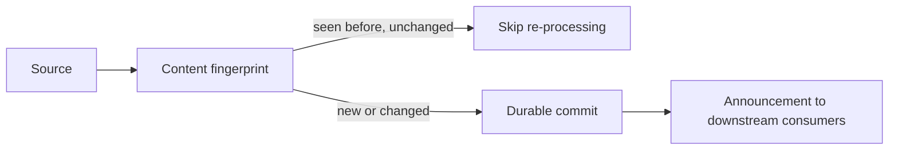

# Ingestion

## What it is

Ingestion is the boundary where a source document, media file or record enters the platform and is given a
stable identity, tenant scope and provenance record — before any extraction, chunking or annotation happens.

## Why it exists

Every downstream plane needs to answer "which tenant does this belong to, and where did it come from" —
and needs that answer to be immutable once established. Deciding identity and provenance once, at the
boundary, means extraction, annotation, indexing and analytics never have to re-derive or dispute it.

## How it works

A cryptographic fingerprint of the raw content is computed first. If the platform has seen the exact same
content before, the pipeline short-circuits — nothing is re-parsed, re-chunked, or re-embedded. Otherwise,
the artifact is durably committed to storage **before** anything about it is announced to the rest of the
system: if the commit fails, nothing downstream ever hears about the document; if the announcement fails
after a successful commit, it is retried, and every consumer is built to safely ignore a duplicate.

## Example

A scheduled crawler re-fetches a page that hasn't changed. Its content fingerprint matches what's already
stored, so ingestion confirms the existing results are still valid and does no further work — making it
safe to run ingestion jobs liberally without worrying about duplicate content or wasted cost.

## Inputs

Raw source bytes (PDF, DOCX, HTML, image, audio, video) or an already-structured record (a ticket, a log
entry), plus tenant and source metadata.

## Outputs

A durably stored artifact with a stable identity, ready for [extraction](extraction-plane.md).

## Transformations

None to the content itself — ingestion establishes identity and provenance, not interpretation.

## Dependencies

Durable storage must acknowledge the commit before the announcement is emitted. See
[Contracts](contracts.md) for the stable interface between ingestion and extraction.

## Change and recalculation

A source change (new version of the same document) produces a new fingerprint and re-enters the full
pipeline; an unchanged re-ingestion is a no-op. See the [Change Matrix](recalculation.md#change-matrix).

## Security

No classification decision has been made yet at this stage — ingestion establishes *where content came
from*, not what it's sensitive to. Classification happens once content is [chunked](semantic-chunking.md).

## Lineage

Every downstream artifact — chunk, annotation, index entry, analytical fact — traces back to the ingested
artifact's stable identity, which is what [Provenance](../concepts/provenance.md) is built on.

## Related concepts

[Content Model](content-model.md) · [Extraction Plane](extraction-plane.md) ·
[Ingestion 101](../guides/overviews/ingestion.md)
