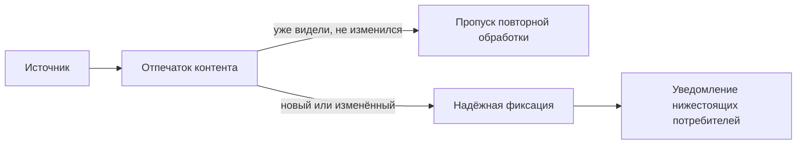

# Приём (Ingestion)

## Что это

Приём — граница, на которой исходный документ, медиафайл или запись попадает в платформу и получает
устойчивую идентичность, принадлежность к тенанту и запись происхождения — прежде чем произойдёт
какое-либо извлечение, чанкирование или аннотирование.

## Почему это нужно

Каждому нижестоящему уровню нужно знать «какому тенанту принадлежит это и откуда оно взялось» — и этот
ответ должен быть неизменным после установления. Определение идентичности и происхождения один раз, на
границе, означает, что извлечению, аннотированию, индексированию и аналитике никогда не придётся заново
выводить или оспаривать этот факт.

## Как это работает

Сначала вычисляется криптографический отпечаток исходного контента. Если платформа уже видела точно такой
же контент, конвейер обрывается — ничего не разбирается, не чанкируется и не векторизуется повторно. Иначе
артефакт надёжно фиксируется в хранилище **до** того, как о нём что-либо сообщается остальной системе:
если фиксация не удалась, нижестоящие компоненты никогда не узнают о документе; если уведомление не удалось
после успешной фиксации, оно повторяется, а каждый потребитель устроен так, чтобы безопасно игнорировать
дубликат.

## Пример

Плановый краулер повторно забирает страницу, которая не изменилась. Её отпечаток контента совпадает с уже
сохранённым, поэтому приём подтверждает, что существующие результаты всё ещё действительны, и не выполняет
дальнейшую работу — это позволяет свободно запускать задания приёма без риска дублирования контента или
лишних затрат.

## Входные данные

Необработанные байты источника (PDF, DOCX, HTML, изображение, аудио, видео) или уже структурированная
запись (тикет, запись лога), плюс метаданные тенанта и источника.

## Выходные данные

Надёжно сохранённый артефакт с устойчивой идентичностью, готовый к [извлечению](extraction-plane.md).

## Преобразования

Никаких — над самим контентом на этом этапе преобразований не происходит: приём устанавливает
идентичность и происхождение, а не интерпретацию.

## Зависимости

Надёжное хранилище должно подтвердить фиксацию прежде, чем будет отправлено уведомление. См.
[Контракты](contracts.md) — стабильный интерфейс между приёмом и извлечением.

## Изменение и пересчёт

Изменение источника (новая версия того же документа) порождает новый отпечаток и заново проходит весь
конвейер; повторный приём без изменений — не выполняет никаких действий. См.
[Матрицу изменений](recalculation.md#change-matrix).

## Безопасность

На этом этапе решение о классификации ещё не принято — приём устанавливает *откуда взялся контент*, а не
то, к чему он чувствителен. Классификация происходит после [чанкирования](semantic-chunking.md) контента.

## Происхождение (lineage)

Каждый нижестоящий артефакт — чанк, аннотация, запись индекса, аналитический факт — восходит к устойчивой
идентичности принятого артефакта, на которой строится [Происхождение](../concepts/provenance.md).

## Связанные концепции

[Модель контента](content-model.md) · [Уровень извлечения](extraction-plane.md) ·
[Ingestion 101](../guides/overviews/ingestion.md)
