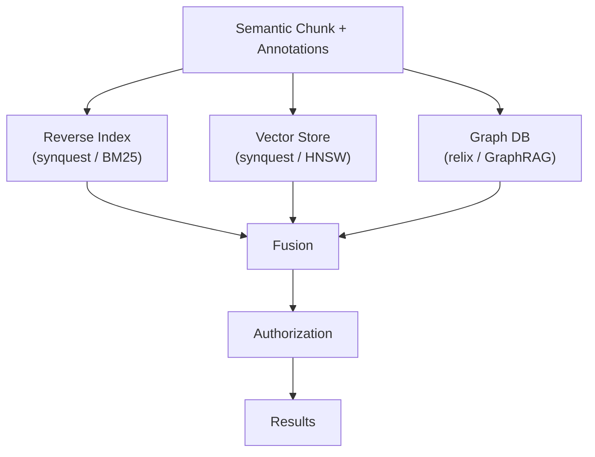

# Knowledge Projections

## What it is

Knowledge projection is the stage where a classified, annotated [semantic chunk](../concepts/chunks.md) is
fanned out — unchanged itself — into three purpose-built stores: a reverse index, a vector store, and a
graph. Each store is a derived, technology-specific view over the same canonical knowledge, never a second
copy of the truth.

## Why it exists

Exact/lexical filtering, semantic similarity, and relationship traversal have genuinely different access
patterns, and no single storage technology is good at all three at once. A reverse index is built to answer
"which passages contain this exact term," a vector store is built to answer "which passages mean roughly
this," and a graph is built to answer "what is connected to what" — three different questions, three
different optimal data structures. Rather than force one engine to do all three badly, Synanton projects the
same chunk three times, once per workload, and lets a query use whichever combination it needs.

## How it works

Projection happens independently per store and in parallel: indexing a chunk into the reverse index doesn't
wait on its embedding, and embedding doesn't wait on graph extraction. Each projection is:

- **Derived** — computed from the chunk and its annotations, never hand-authored.
- **Replaceable** — can be dropped and rebuilt from canonical knowledge at any time, with no information
  loss, because the chunk remains the source of truth.
- **Lineage-aware** — every entry, vector, node and edge carries a reference back to the chunk it came from.

See [Search 101](../guides/overviews/search.md) for the narrative version of how the three stores'
results get fused into a single ranked answer.

## Example

A search for *"which suppliers have contracts expiring soon, and what are the termination requirements?"*
draws on all three projections at once: the reverse index finds clauses containing "termination" and
"expiration," the vector store finds a clause that says "either party may terminate this agreement" without
using either word, and the graph finds the supplier entity tied to a related amendment filed in a different
document. None of the three stores "wins" — fusion combines their opinions into one ranked, access-filtered
result set.

## Inputs

Classified, annotated semantic chunks — chunk text (and its masked representation, where applicable),
entity/relationship annotations, security classification, and metadata.

## Outputs

- Reverse index: postings and filterable fields keyed by `chunk_id`. See [Reverse Index](reverse-index.md).
- Vector store: one or more embeddings per chunk, keyed by `chunk_id`. See [Vector Store](vector-store.md).
- Graph: nodes and edges tied to the chunk(s) that produced them. See [Graph](graph.md).

## Transformations

Tokenization and field indexing (chunk → reverse index), embedding inference (chunk → vector), and entity /
relationship extraction against the platform ontology (chunk → graph nodes and edges). Each transformation
is projection-specific and independently derived from the same source chunk — none of them modifies the
chunk itself.

## Dependencies

Depends on [chunks](../concepts/chunks.md) and [annotations](../concepts/annotations.md) being stable —
projection re-runs whenever the chunk or its annotations change, not on a fixed schedule. Depends on the
platform ontology (for graph extraction) and the configured embedding model (for the vector store) each
being pinned to a known version, since either can change independently of the other.

## Change and recalculation

Changing an embedding model version, a graph ontology mapping, or an indexing/analyzer scheme invalidates
and triggers recalculation of *only* the affected projection — canonical knowledge itself is never touched,
and the other two projections are untouched too. See the
[change impact model](recalculation.md#change-impact-model). [Resolutor](resolutor.md) determines which
projected entries became stale; [Equalix](equalix.md) controls how the recalculation is actually executed
(batched, prioritized, throttled).

## Security

Every projection must preserve the chunk's representation contract: a chunk with a masked and an original
representation is projected as two index entries, two vectors, or two graph node variants — never merged,
never cross-contaminated. Vector and graph results in particular remain connected to canonical knowledge and
its authorization metadata, so a similarity match or a traversal hit is exactly as access-controlled as a
keyword match — projections never bypass security, they inherit it from the chunk they were derived from.
See [Security-Aware Search](../concepts/security-aware-search.md).

## Lineage

Every projected entry — an index posting, a vector, a graph node or edge — retains a pointer back to its
source `chunk_id`, so any search result is traceable to the canonical knowledge it came from, and any
projection can be regenerated from that knowledge if it's ever dropped or corrupted.

## Related concepts

[Knowledge Projections (concept)](../concepts/knowledge-projections.md) · [Reverse Index](reverse-index.md) ·
[Vector Store](vector-store.md) · [Graph](graph.md) · [Search 101](../guides/overviews/search.md) ·
[Security-Aware Search](../concepts/security-aware-search.md)
