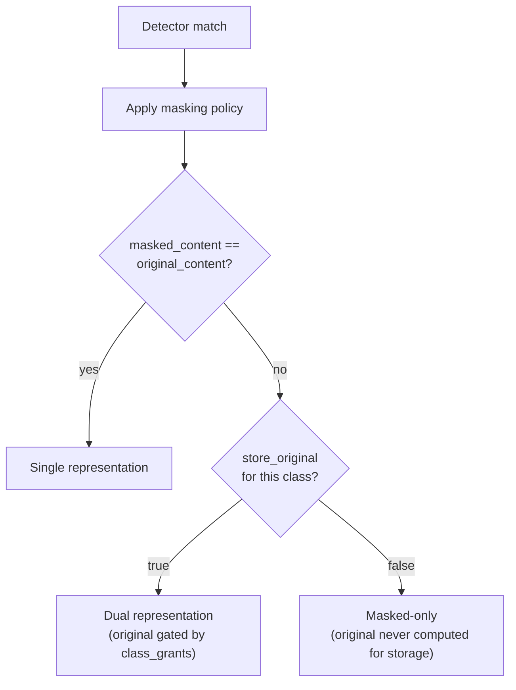

# Masking

## What it is

Masking is the transformation that decides which representation of a classified chunk exists in storage —
Single, Dual, or Masked-only — computed once, at ingest, from the chunk's classification and its per-class
masking policy.

## Why it exists

Classification alone answers "how sensitive is this content?" — it says nothing about what an
unauthorized reader should actually receive. Deciding that at query time, per request, would mean
reconstructing or withholding sensitive values on every read — expensive, and one bug away from a leak.
Masking exists to make that decision exactly once, durably, so query-time enforcement only has to *select*
between representations that already exist, never compute a new one.

## How it works

| Outcome | Storage | Access |
|---|---|---|
| **Single** | One `content` field | Everyone with resource access |
| **Dual** | `content_masked` (always) + `content_original` (grant-gated) | Authorized callers get original; others get masked |
| **Masked-only** | `content_masked` only | Everyone, including class-authorized callers — no original ever exists |

This propagates to every store: the reverse index carries two Lucene fields for a Dual chunk, never one
merged field; the embedding cache keys on `(tenant, class, representation, chunk_text_hash)`, producing two
distinct embeddings for a Dual chunk rather than assuming masked and original text embed identically; the
graph tags entities and edges with `representation` the same way.

## Example

`"Salary: €180,000"` → `"Salary: [REDACTED:FINANCIAL]"` is a Dual outcome — both forms exist, gated by
`class_grants` at query time. `"SSN: 000-00-0000"` → `"SSN: [REDACTED:SSN]"` with `store_original: false`
is Masked-only — `"000-00-0000"` is never computed for storage, so there is no original for even a fully
authorized caller to retrieve.

## Inputs

A chunk's `classification[]` (from [Security](security.md)) and its per-class masking policy
(`action: MASK`, `store_original: true|false`).

## Outputs

Exactly one representation outcome per chunk, propagated consistently into the reverse index, vector
store, and graph — see [Knowledge Projections](knowledge-projections.md).

## Transformations

Masking runs once, before any store commit. It is never recomputed per query and never reconstructs an
original from a masked value.

## Dependencies

Depends on [Security](security.md) classification having already run. Every [knowledge projection](knowledge-projections.md)
must respect whichever outcome was decided, without exception.

## Change and recalculation

Changing a masking policy (flipping `store_original` for a class) requires a `ReindexAfterPolicyChangeWorkflow`
over affected chunks — re-detect, re-mask, re-index — per the [change impact model](recalculation.md#change-impact-model).
It is not a query-time toggle.

## Security

Masked-only is a hard guarantee, not a default that can be silently weakened: the sensitive literal is
never written to any store, for anyone, at any tier of access. See
[Security-Aware Search](security-aware-search.md) for how representation selection uses this at query time.

## Lineage

Every representation decision — which outcome, which policy version — is recorded as part of the chunk's
provenance.

## Related concepts

[Security](security.md) · [Security-Aware Search](security-aware-search.md) ·
[Masking (concept)](../concepts/masking.md) · [Security Guides](../guides/security/index.md)
