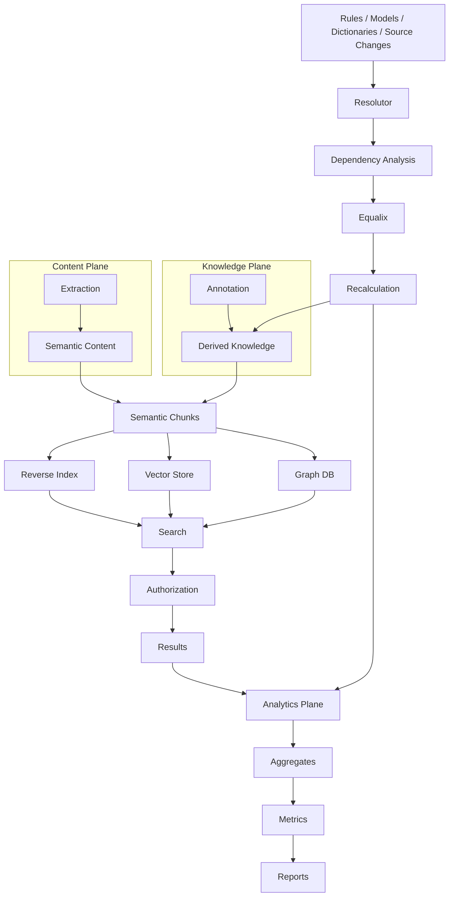

# Architecture Overview

## What it is

The Synanton architecture is organized as a sequence of planes, each responsible for one transformation in
the journey from raw content to measurable, secured, searchable knowledge. This page is the navigation hub
for the Architecture section — it doesn't repeat what each plane does in depth, it shows how they connect
and where to go for depth.

## Why it exists

An enterprise knowledge platform touches extraction, chunking, annotation, security, three different
knowledge stores, search, recalculation and analytics. Without an explicit map of how those planes relate,
it's easy to conflate concerns that the architecture deliberately keeps separate — most importantly,
*extraction* (what content contains) from *annotation* (what Synanton understands), and *classification*
(a property of content) from *authorization* (a property of policy).

## How it works

Architecture documentation follows the data flow:

```text
Source
 ↓
Ingestion
 ↓
Extraction Plane
 ↓
Semantic Content
 ↓
Chunking
 ↓
Annotation Plane
 ↓
Knowledge Projections
 ↓
Search
 ↓
Security
 ↓
Recalculation
 ↓
Analytics Plane
```

Supporting architecture, used across every plane above rather than belonging to one stage of the pipeline:

```text
Resolutor    — determines what needs to change
Equalix      — controls how changes are executed
Contracts    — stable interfaces between planes
Polyglot Architecture — why planes can use different implementation technologies
MCP          — integration/access interface
Scaling      — how the platform grows with load
```

## The converged architecture diagram



## Reading order

| Plane | Pages |
|---|---|
| Content | [Ingestion](ingestion.md) · [Extraction Plane](extraction-plane.md) · [Content Model](content-model.md) · [Semantic Chunking](semantic-chunking.md) |
| Knowledge | [Annotation Plane](annotation-plane.md) · [Annotation Dependencies](annotation-dependencies.md) |
| Projections | [Knowledge Projections](knowledge-projections.md) · [Reverse Index](reverse-index.md) · [Vector Store](vector-store.md) · [Graph](graph.md) |
| Search & Security | [Search Architecture](search-architecture.md) · [Security](security.md) · [Security-Aware Search](security-aware-search.md) · [Masking](masking.md) |
| Recalculation | [Recalculation](recalculation.md) · [Resolutor](resolutor.md) · [Equalix](equalix.md) |
| Analytics | [Analytics Plane](analytics-plane.md) · [Analytics Events](analytics-events.md) · [Analytical Facts](analytical-facts.md) · [Metrics](metrics.md) · [Reporting](reporting.md) |
| Cross-cutting | [Polyglot Architecture](polyglot-architecture.md) · [Contracts](contracts.md) · [MCP](mcp.md) · [Scaling](scaling.md) |

## The most important distinction

> **Knowledge remains authoritative. Search, graph and analytics are projections. Resolutor determines what
> becomes stale. Equalix controls how changes are executed. Security remains enforced across every
> projection and access path.**

## Related concepts

[What is Synanton?](../concepts/synanton.md) · [How Data Flows Through Synanton](../getting-started/architecture-overview.md) ·
[Documentation Governance](../design/index.md)
