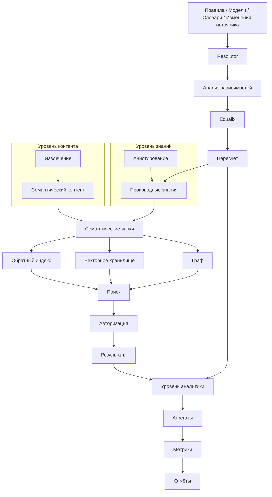

# Обзор архитектуры

## Что это

Архитектура Synanton организована как последовательность уровней (planes), каждый из которых отвечает за
одно преобразование на пути от исходного контента к измеримым, защищённым и доступным для поиска знаниям.
Эта страница — навигационный узел раздела «Архитектура»: она не повторяет подробно, что делает каждый
уровень, а показывает, как они связаны и куда идти за подробностями.

## Почему она существует

Платформа корпоративных знаний затрагивает извлечение, чанкирование, аннотирование, безопасность, три
разных хранилища знаний, поиск, пересчёт и аналитику. Без явной карты того, как эти уровни соотносятся,
легко смешать понятия, которые архитектура сознательно разделяет — прежде всего, *извлечение* (что
содержит контент) и *аннотирование* (что понимает Synanton), а также *классификацию* (свойство контента)
и *авторизацию* (свойство политики).

## Как это работает

Документация по архитектуре следует потоку данных:

```text
Источник
 ↓
Приём
 ↓
Уровень извлечения
 ↓
Семантический контент
 ↓
Чанкирование
 ↓
Уровень аннотирования
 ↓
Проекции знаний
 ↓
Поиск
 ↓
Безопасность
 ↓
Пересчёт
 ↓
Уровень аналитики
```

Сквозная архитектура, используемая во всех уровнях выше, а не принадлежащая одному этапу конвейера:

```text
Resolutor             — определяет, что нужно изменить
Equalix               — управляет тем, как изменения выполняются
Контракты             — стабильные интерфейсы между уровнями
Полиглотная архитектура — почему уровни могут использовать разные технологии реализации
MCP                   — интерфейс интеграции/доступа
Масштабирование       — как платформа растёт вместе с нагрузкой
```

## Итоговая диаграмма архитектуры



## Порядок чтения

| Уровень | Страницы |
|---|---|
| Контент | [Приём](ingestion.md) · [Уровень извлечения](extraction-plane.md) · [Модель контента](content-model.md) · [Семантическое чанкирование](semantic-chunking.md) |
| Знания | [Уровень аннотирования](annotation-plane.md) · [Зависимости аннотаций](annotation-dependencies.md) |
| Проекции | [Проекции знаний](knowledge-projections.md) · [Обратный индекс](reverse-index.md) · [Векторное хранилище](vector-store.md) · [Граф](graph.md) |
| Поиск и безопасность | [Архитектура поиска](search-architecture.md) · [Безопасность](security.md) · [Поиск с учётом безопасности](security-aware-search.md) · [Маскирование](masking.md) |
| Пересчёт | [Пересчёт](recalculation.md) · [Resolutor](resolutor.md) · [Equalix](equalix.md) |
| Аналитика | [Уровень аналитики](analytics-plane.md) · [Аналитические события](analytics-events.md) · [Аналитические факты](analytical-facts.md) · [Метрики](metrics.md) · [Отчётность](reporting.md) |
| Сквозные темы | [Полиглотная архитектура](polyglot-architecture.md) · [Контракты](contracts.md) · [MCP](mcp.md) · [Масштабирование](scaling.md) |

## Главное различие

> **Знания остаются источником истины. Поиск, граф и аналитика — это проекции. Resolutor определяет, что
> устарело. Equalix управляет тем, как выполняются изменения. Безопасность применяется во всех проекциях
> и путях доступа.**

## Связанные концепции

[Что такое Synanton?](../concepts/synanton.ru.md) ·
[Как данные проходят через Synanton](../getting-started/architecture-overview.ru.md) ·
[Управление документацией](../design/index.md)
