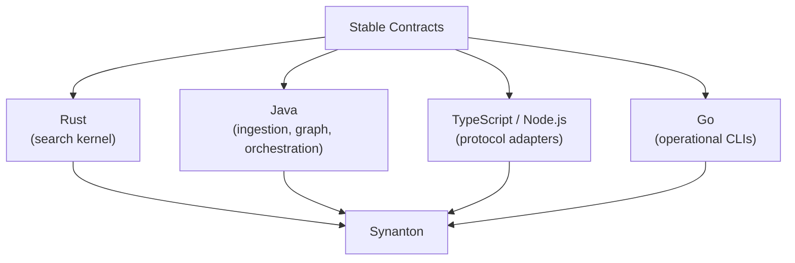

# Polyglot Architecture

## What it is

Polyglot architecture is the decision that no module in Synanton is required to use the same programming
language, runtime, or storage technology as any other module — as long as it communicates across module
boundaries only through a stable [contract](contracts.md).

## Why it exists

Different workloads genuinely want different tools. A search kernel doing SIMD-optimized nearest-neighbor
math wants a systems language with tight control over memory layout; a GraphRAG engine orchestrating
traversal, synthesis, and an MCP/ACP surface wants a mature ecosystem for service orchestration; a protocol
adapter exposing an existing API to a new integration wants whatever library ecosystem that protocol is
best supported in; an operational CLI wants a single static binary that's trivial to distribute. Forcing all
four onto one stack means at least three of them are working with the wrong tool. Analytics storage follows
the same reasoning: no single storage technology is assumed optimal for every analytical workload either —
see [Why Three Stores?](knowledge-projections.md#why-it-exists) for the same principle applied to search.

## How it works

> **Polyglot by implementation, contract-driven by architecture.**

Concretely, across the platform's modules: the hybrid search kernel is written in Rust for tight control
over SIMD-optimized nearest-neighbor search and lexical indexing; the GraphRAG engine, the ingestion
pipeline, and most orchestration services are written in Java on a shared ecosystem for service composition;
a protocol adapter that exposes the platform's public API as MCP tools is written in Node.js/TypeScript;
operational day-2 tooling ships as Go CLIs, valued for producing a single dependency-free binary. None of
these modules import each other's internals — they only ever call each other through the
[contracts](contracts.md) each boundary defines, which is what makes the language choice invisible outside
the module that made it.

## Example

The search kernel could be rewritten from Rust into a different systems language entirely — for performance
reasons, for hiring reasons, for any reason — and nothing on the other side of its contract, including the
query planner that calls it and the annotation pipeline that feeds it, would need to change at all, provided
the rewrite still satisfies the same contract tests. That's the property polyglot architecture is buying:
implementation churn stops being platform-wide churn.

## Inputs

A workload's actual requirements — latency budget, ecosystem maturity, memory-safety needs, distribution
model — evaluated independently for each module, rather than inherited from whatever the rest of the
platform happens to use.

## Outputs

An implementation choice per module that is entirely invisible outside that module's contract boundary — a
consuming module can't tell, and doesn't need to know, what language or storage technology produced the
data it's consuming.

## Transformations

None directly — polyglot architecture is a policy governing *how implementation choices are made*, not a
data transformation. The actual transformations happen inside each module (see
[Extraction Plane](extraction-plane.md), [Semantic Chunking](semantic-chunking.md),
[Knowledge Projections](knowledge-projections.md)) and are unaffected by this page.

## Dependencies

Depends entirely on [Contracts](contracts.md) being genuinely stable and genuinely enforced — mirrored
schema definitions and contract tests that run independently against both sides of a boundary. Polyglot
architecture without enforced contracts degenerates into implementation coupling by accident; the contract
discipline is the only thing keeping the boundaries real.

## Change and recalculation

Swapping a module's implementation language or underlying technology entirely is a non-event for the rest
of the platform as long as the contract — and its automated tests — still hold; nothing downstream needs to
be recalculated because the contract's guaranteed output didn't change. Only a *contract* change ripples,
and it ripples exactly as described in [Contracts → Change and recalculation](contracts.md#change-and-recalculation),
regardless of which languages sit on either side of it.

## Security

A security-relevant contract — classification, representation, authorization metadata — must be honored
identically no matter which language implements either side of it. Polyglot never means "each
implementation decides its own security semantics"; it means implementation is free to vary everywhere a
contract doesn't constrain it, and security-relevant contracts constrain exactly the parts that matter.

## Lineage

This page doesn't itself produce lineage data, but which contract version — and, for forensics, which
implementation — produced a given artifact remains part of that artifact's provenance, recorded at the
contract layer described in [Contracts → Lineage](contracts.md#lineage).

## Related concepts

[Contracts](contracts.md) · [Contracts (concept)](../concepts/contracts.md) ·
[Knowledge Projections](knowledge-projections.md) · [MCP](mcp.md) · [Scaling](scaling.md)
