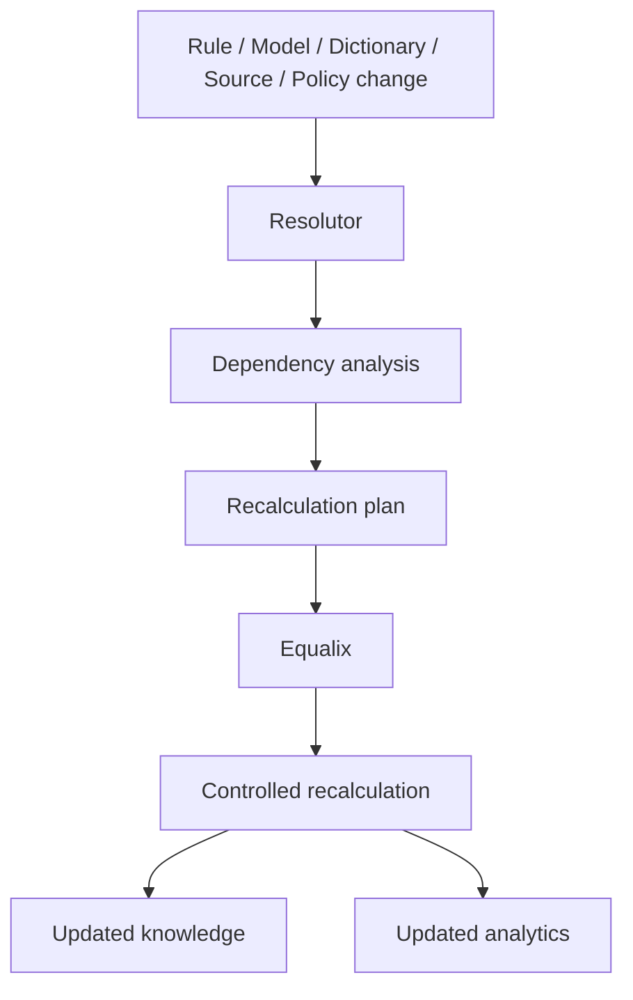

# Recalculation

## What it is

Recalculation is the platform's answer to "something changed — now what?" It is the process of determining
exactly which derived knowledge became stale because a source, a rule, a model, a dictionary or a policy
changed, and updating only that — never a blanket rebuild of everything the platform has ever produced.

## Why it exists

Annotations, embeddings, search projections and analytics are all *derived* state (see
[§4.9, Derived knowledge is recalculable](../design/synanton-design-1.25.md)) — they are computed from
something else, and that something else is allowed to change. A platform without recalculation has exactly
two bad options when a rule or model changes: rebuild everything (correct but prohibitively expensive at
scale) or rebuild nothing and let stale annotations silently drift from the truth (cheap but wrong).
Recalculation exists so the platform can be both correct and economical: it changes what depends on what
changed, and nothing else.

## How it works



[Resolutor](resolutor.md) walks the explicit dependency graph to decide **what** needs to change, producing
a recalculation plan. [Equalix](equalix.md) decides **how** that plan is executed — with what priority,
concurrency and resource limits — relative to every other workload competing for execution capacity. The
two responsibilities are deliberately separate: Resolutor never schedules anything, and Equalix never
decides what is affected. See [the most important distinction](overview.md#the-most-important-distinction).

### Change Matrix

Impact is not uniform across change types. The matrix below is the architecture's explicit change-impact
model — it defines what a given change is allowed to touch, and just as importantly, what it must *not*
touch.

| Change | Extraction | Chunking | Annotation | Reverse Index | Vector | Graph | Analytics | Search Policy |
|---|---:|---:|---:|---:|---:|---:|---:|---:|
| Source content | ✓ | ✓ | ✓ | ✓ | ✓ | ✓ | ✓ | — |
| Extraction logic | ✓ | ✓ | ✓ | ✓ | ✓ | ✓ | ✓ | — |
| Chunking logic | — | ✓ | ✓ | ✓ | ✓ | ✓ | ✓ | — |
| Annotation rule | — | — | ✓ | ✓ | maybe | maybe | ✓ | — |
| Annotation dependency | — | — | ✓ | ✓ | maybe | maybe | ✓ | — |
| Embedding model | — | — | — | — | ✓ | — | ✓ | — |
| Security classification logic | — | — | ✓ | ✓ | policy-dependent | policy-dependent | ✓ | — |
| Group → classification mapping | — | — | — | — | — | — | query/cache policy | ✓ |
| Masking policy | — | policy-dependent | policy-dependent | policy-dependent | policy-dependent | policy-dependent | policy-dependent | ✓ |
| Metric definition | — | — | — | — | — | — | ✓ | — |
| Report definition | — | — | — | — | — | — | ✓ | — |

The most important row to internalize is **Group → classification mapping**: a change to who is allowed to
see which classification produces *no* recalculation of stored knowledge at all — only a policy/cache-level
effect at search time. See [Security](#security) below.

## Example

An annotation definition for `payment-detection` is upgraded from v3 to v4. Resolutor walks the dependency
graph and finds every annotation that was produced by v3, plus every annotation that depends on those —
nothing else. Equalix schedules the re-evaluation as background work, behind interactive search and
incremental ingestion for every tenant. Chunks that never touched `payment-detection` are never re-read,
re-indexed, or re-embedded. Historical `payment-detection v3` annotations remain queryable for comparison
unless governance requires their invalidation.

## Inputs

The same inputs [Resolutor](resolutor.md) consumes: source changes, extraction changes, chunking changes,
annotation rule and definition changes, model changes, dictionary changes, dependency changes, and security
classification changes.

## Outputs

A recalculation plan naming affected content, affected annotations, affected dependencies, affected
projections and affected analytics — followed, once [Equalix](equalix.md) executes that plan, by updated
knowledge and updated analytics.

## Transformations

Recalculation re-evaluates exactly the derived objects the Change Matrix says are affected: it re-extracts,
re-chunks, re-annotates, re-indexes, re-embeds or re-projects into the graph, depending on the row. It
deliberately does **not** transform anything the matrix marks `—`. The clearest case is a group →
classification mapping change:

```text
Group mapping changes
    ↓
No content rewrite
No chunk rewrite
No annotation recalculation
No index rebuild
No graph rebuild
    ↓
New authorization decision at search time
```

The classification stored with content doesn't move; only the mapping from group to allowed classifications
changes, and that's evaluated dynamically at query time. See [§4.5, Classify once, authorize dynamically](../design/synanton-design-1.25.md).

## Dependencies

Recalculation only works because [annotation and projection dependencies](annotation-dependencies.md) are
explicit (§4.4) — an implicit dependency can't be walked, and can't be trusted to be complete. It depends on
[Resolutor](resolutor.md) for impact analysis and [Equalix](equalix.md) for controlled execution, and on
[Provenance](../concepts/provenance.md) to trace affected objects back to the change that produced them.

## Change and recalculation

Recalculation itself branches by change type:

**Source change** — a new document version re-enters the pipeline from extraction forward: extraction,
chunking, annotation, projections and analytics all potentially re-run for that content, per the Change
Matrix.

**Annotation rule or definition change** — only the annotations produced under the old definition, and
whatever depends on them, are affected; unrelated content and unrelated annotations are untouched.

**Security mapping change** — no recalculation of stored knowledge at all; only the search-time
authorization decision changes, though authorization-sensitive analytical caches still need invalidation
(see [§4.10–4.12](../design/synanton-design-1.25.md) and the [Analytics Plane](analytics-plane.md), lightly
— analytics' own recalculation behavior is covered there in depth).

Resolutor is deterministic for a given dependency graph and change set: re-running the same change against
the same graph always produces the same plan, which is what makes recalculation safe to retry.

## Security

Recalculation must never widen access as a side effect of updating derived state. Security classification
*logic* changes (how sensitivity is detected) do trigger re-annotation and downstream recalculation; group →
classification *mapping* changes do not, by design (§4.5) — collapsing that distinction would mean either
rewriting content unnecessarily on every policy tweak, or under-reacting when detection logic itself
changes. Where classification does change in a way that affects previously computed analytical facts, the
platform supports three treatment classes: recalculation/invalidation (preferred for current-state metrics),
historical validity windows (`valid_from`/`valid_to`, required where audit or compliance needs historical
truth queryable under the policy that existed at the time), and query-time evaluation (suitable when the
underlying fact hasn't changed, only who may see it).

## Lineage

Every recalculation is tied to a processing run and an evaluation run, both traceable back through
[Provenance](../concepts/provenance.md) to the change that triggered them. Recalculation does not erase
history by default — prior annotation versions and prior analytical facts can remain queryable for
comparison (`payment-detection v3` vs `v4`) unless governance explicitly requires invalidation.

## Related concepts

[Resolutor](resolutor.md) · [Equalix](equalix.md) · [Annotation Dependencies](annotation-dependencies.md) ·
[Architecture Overview](overview.md) · [Provenance](../concepts/provenance.md) ·
[Synanton Design 1.25](../design/synanton-design-1.25.md)
