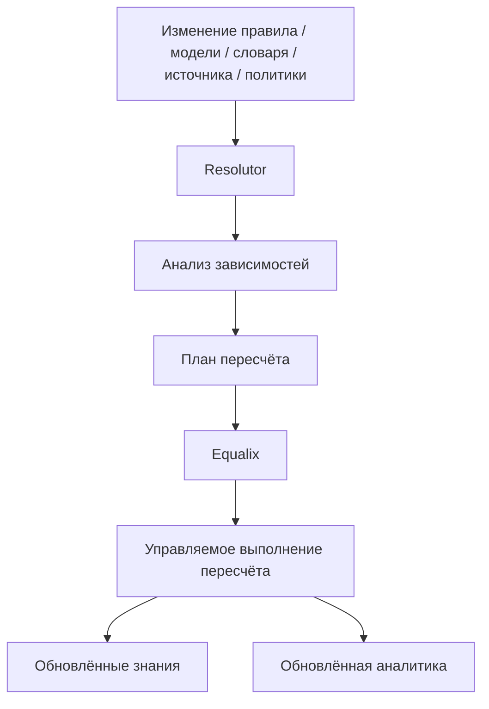

# Пересчёт

## Что это

Пересчёт — это ответ платформы на вопрос «что-то изменилось — что теперь?». Это процесс, который точно
определяет, какие производные знания устарели из-за изменения источника, правила, модели, словаря или
политики, и обновляет только их — а не выполняет сплошную перестройку всего, что платформа когда-либо
произвела.

## Почему это существует

Аннотации, эмбеддинги, поисковые проекции и аналитика — всё это *производное* состояние (см.
[§4.9, Производные знания подлежат пересчёту](../design/synanton-design-1.25.md)): они вычисляются из
чего-то другого, а это «другое» может меняться. У платформы без пересчёта есть ровно два плохих варианта,
когда меняется правило или модель: перестроить всё (корректно, но непозволительно дорого при масштабе) или
не перестраивать ничего и позволить устаревшим аннотациям молча расходиться с истиной (дёшево, но неверно).
Пересчёт существует, чтобы платформа могла быть одновременно корректной и экономной: он меняет то, что
зависит от изменившегося, и ничего сверх этого.

## Как это работает



[Resolutor](resolutor.ru.md) проходит по явному графу зависимостей, чтобы определить, **что** нужно
изменить, и формирует план пересчёта. [Equalix](equalix.ru.md) решает, **как** этот план будет выполнен —
с каким приоритетом, конкурентностью и ограничением ресурсов — относительно всех остальных нагрузок,
конкурирующих за выполнение. Эти две обязанности сознательно разделены: Resolutor никогда ничего не
планирует, а Equalix никогда не решает, что затронуто. См. [главное различие](overview.ru.md#главное-различие) в обзоре архитектуры.

### Матрица изменений

Влияние изменения неоднородно по типам изменений. Матрица ниже — явная модель влияния изменений в
архитектуре: она определяет, что данное изменение может затронуть, и, что не менее важно, чего оно
затронуть *не должно*.

| Изменение | Извлечение | Чанкирование | Аннотирование | Обратный индекс | Вектор | Граф | Аналитика | Политика поиска |
|---|---:|---:|---:|---:|---:|---:|---:|---:|
| Содержимое источника | ✓ | ✓ | ✓ | ✓ | ✓ | ✓ | ✓ | — |
| Логика извлечения | ✓ | ✓ | ✓ | ✓ | ✓ | ✓ | ✓ | — |
| Логика чанкирования | — | ✓ | ✓ | ✓ | ✓ | ✓ | ✓ | — |
| Правило аннотирования | — | — | ✓ | ✓ | возможно | возможно | ✓ | — |
| Зависимость аннотирования | — | — | ✓ | ✓ | возможно | возможно | ✓ | — |
| Модель эмбеддингов | — | — | — | — | ✓ | — | ✓ | — |
| Логика классификации безопасности | — | — | ✓ | ✓ | зависит от политики | зависит от политики | ✓ | — |
| Отображение «группа → классификация» | — | — | — | — | — | — | политика запроса/кэша | ✓ |
| Политика маскирования | — | зависит от политики | зависит от политики | зависит от политики | зависит от политики | зависит от политики | зависит от политики | ✓ |
| Определение метрики | — | — | — | — | — | — | ✓ | — |
| Определение отчёта | — | — | — | — | — | — | ✓ | — |

Самая важная строка для понимания — **«Отображение «группа → классификация»»**: изменение того, кому
разрешено видеть какую классификацию, не порождает вообще никакого пересчёта сохранённых знаний — только
эффект на уровне политики/кэша во время поиска. См. раздел [Безопасность](#безопасность) ниже.

## Пример

Определение аннотации `payment-detection` обновляется с версии v3 до v4. Resolutor проходит по графу
зависимостей и находит все аннотации, произведённые по v3, а также все аннотации, которые сами зависят от
них — и ничего больше. Equalix планирует повторную оценку как фоновую работу, позади интерактивного поиска
и инкрементального приёма для каждого тенанта. Чанки, которые никогда не касались `payment-detection`,
повторно не читаются, не индексируются и не векторизуются. Исторические аннотации `payment-detection v3`
остаются доступными для сравнения, если только управление данными не требует их аннулирования.

## Входные данные

Те же входные данные, что и у [Resolutor](resolutor.ru.md): изменения источника, изменения извлечения,
изменения чанкирования, изменения правил и определений аннотаций, изменения моделей, изменения словарей,
изменения зависимостей и изменения классификации безопасности.

## Выходные данные

План пересчёта, называющий затронутый контент, затронутые аннотации, затронутые зависимости, затронутые
проекции и затронутую аналитику — а после выполнения этого плана [Equalix](equalix.ru.md) — обновлённые
знания и обновлённую аналитику.

## Преобразования

Пересчёт переоценивает ровно те производные объекты, которые Матрица изменений отмечает как затронутые: он
повторно извлекает, повторно чанкирует, повторно аннотирует, повторно индексирует, повторно векторизует или
повторно проецирует в граф — в зависимости от строки. Он сознательно **не** преобразует ничего, что матрица
отмечает как «—». Самый явный случай — изменение отображения «группа → классификация»:

```text
Меняется отображение групп
    ↓
Без перезаписи контента
Без перезаписи чанков
Без пересчёта аннотаций
Без перестройки индекса
Без перестройки графа
    ↓
Новое решение об авторизации во время поиска
```

Классификация, сохранённая с контентом, никуда не перемещается — меняется только отображение группы на
разрешённые классификации, и это вычисляется динамически во время запроса. См.
[§4.5, Классифицируй один раз, авторизуй динамически](../design/synanton-design-1.25.md).

## Зависимости

Пересчёт работает только потому, что [зависимости аннотаций и проекций](annotation-dependencies.ru.md)
явные (§4.4) — неявную зависимость невозможно пройти и невозможно считать полной. Он зависит от
[Resolutor](resolutor.ru.md) для анализа влияния и от [Equalix](equalix.ru.md) для управляемого выполнения,
а также от [Происхождения](../concepts/provenance.md) для трассировки затронутых объектов к изменению, их
породившему.

## Изменение и пересчёт

Сам пересчёт разветвляется по типу изменения:

**Изменение источника** — новая версия документа заново входит в конвейер, начиная с извлечения:
извлечение, чанкирование, аннотирование, проекции и аналитика потенциально выполняются повторно для этого
контента, согласно Матрице изменений.

**Изменение правила или определения аннотации** — затрагиваются только аннотации, произведённые по старому
определению, и всё, что от них зависит; несвязанный контент и несвязанные аннотации не затрагиваются.

**Изменение отображения безопасности** — вообще без пересчёта сохранённых знаний; меняется только решение
об авторизации во время поиска, хотя аналитические кэши, чувствительные к авторизации, всё равно требуют
инвалидации (см. [§4.10–4.12](../design/synanton-design-1.25.md) и [Уровень аналитики](analytics-plane.md) —
собственное поведение пересчёта аналитики подробно рассматривается там).

Resolutor детерминирован для данного графа зависимостей и набора изменений: повторный прогон одного и того
же изменения по одному и тому же графу всегда даёт один и тот же план, что и делает пересчёт безопасным для
повторного запуска.

## Безопасность

Пересчёт никогда не должен расширять доступ как побочный эффект обновления производного состояния.
Изменения *логики* классификации безопасности (как определяется чувствительность) действительно вызывают
повторное аннотирование и последующий пересчёт; изменения *отображения* группы на классификацию — нет, по
замыслу (§4.5) — стирание этого различия означало бы либо ненужную перезапись контента при каждой мелкой
настройке политики, либо недостаточную реакцию, когда меняется сама логика определения. Там, где
классификация всё же меняется так, что затрагивает ранее вычисленные аналитические факты, платформа
поддерживает три класса обработки: пересчёт/инвалидация (предпочтительно для метрик текущего состояния),
окна исторической действительности (`valid_from`/`valid_to`, необходимы там, где аудит или соответствие
требованиям требуют, чтобы историческая истина оставалась доступной по запросу под политикой, действовавшей
на тот момент), и вычисление во время запроса (подходит, когда сам факт не изменился — изменилось только то,
кто имеет право его видеть).

## Происхождение

Каждый пересчёт привязан к обработочному прогону (processing run) и оценочному прогону (evaluation run),
оба трассируются через [Происхождение](../concepts/provenance.md) к изменению, которое их вызвало.
Пересчёт по умолчанию не уничтожает историю — предыдущие версии аннотаций и предыдущие аналитические факты
могут оставаться доступными для сравнения (`payment-detection v3` против `v4`), если только управление
данными явно не требует их аннулирования.

## Связанные концепции

[Resolutor](resolutor.ru.md) · [Equalix](equalix.ru.md) ·
[Зависимости аннотаций](annotation-dependencies.ru.md) · [Обзор архитектуры](overview.ru.md) ·
[Происхождение](../concepts/provenance.md) · [Synanton Design 1.25](../design/synanton-design-1.25.md)
