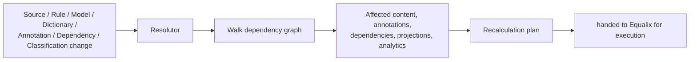

# Resolutor

## What it is

Resolutor is the component that determines **what needs to change**. Given a change — to a source, a rule,
a model, a dictionary, an annotation, a dependency or a classification — Resolutor walks the explicit
dependency graph and produces a recalculation plan naming exactly the affected objects. It never executes
anything itself.

## Why it exists

Once knowledge is derived rather than hand-authored (see [§4.9](../design/synanton-design-1.25.md)),
someone has to answer "affected by this change: what, precisely?" before any work is scheduled. Doing that
analysis ad hoc, inside whatever job happens to react to a change, means the answer is only as good as that
one job's understanding of the dependency graph — and different jobs drift out of agreement over time.
Resolutor exists to make impact analysis a single, deterministic, independently testable step that every
other change-driven workload relies on, rather than something each of them re-derives.

## How it works

Resolutor treats the dependency graph as data, not as something to infer. It takes a change event, finds
every node in the graph that transitively depends on what changed, and emits a plan — a list of affected
objects grouped by kind. It hands that plan to [Equalix](equalix.md) and stops; scheduling, prioritization,
retries and resource limits are entirely Equalix's concern. Resolutor is deterministic for a given
dependency graph and change set: the same change replayed against the same graph produces the same plan,
which is what lets a plan be recomputed safely rather than trusted blindly.

The walk itself is a closure over the dependency graph, not a heuristic guess at "what probably needs
updating." If annotation B declares a dependency on annotation A, and A is affected, B is affected — full
stop, regardless of how deep the chain runs or how unrelated B looks on the surface. That's what makes the
Change Matrix (see [Recalculation](recalculation.md#change-matrix)) a trustworthy contract rather than a
rule of thumb: Resolutor is the component that actually enforces it, change by change, rather than the
matrix being aspirational documentation nobody checks against.

It's worth stating plainly where Resolutor's job ends, because the two are easy to conflate: Resolutor
answers "what is affected," Equalix answers "when and in what order should the affected things actually be
recalculated." Resolutor never looks at queue depth, tenant load, or executor capacity — those questions
don't exist for it. Equalix never looks at the dependency graph — it receives a plan as an opaque unit of
work and schedules it. Neither component can substitute for the other, and merging them would remove the
ability to reason about impact correctness and execution safety independently.

## Example

An annotation definition for `topic-classification` is upgraded from v2 to v3. Resolutor looks up every
annotation produced under v2, then follows the dependency edges forward to find annotations that were
themselves derived from those (for example, a downstream "escalation risk" annotation that reads
`topic-classification`). The plan names both sets. A chunk that was never annotated with
`topic-classification` v2 does not appear in the plan at all — Resolutor doesn't reason about it, and
nothing downstream will touch it.

## Inputs

Source changes, extraction changes, chunking changes, annotation rule changes, annotation definition
changes, model changes, dictionary changes, dependency changes, security classification changes, and
analytics definition changes.

## Outputs

A recalculation plan: affected content, affected annotations, affected dependencies, affected projections
and affected analytics — the same vocabulary the [Change Matrix](recalculation.md#change-matrix) uses to
describe impact.

## Transformations

None to knowledge itself. Resolutor's only transformation is a change event into an impact plan; it never
mutates a chunk, an annotation, an index entry or a graph node. That separation is what makes it safe to
re-run: computing a plan twice is free, and computing a wrong plan can be caught before anything is executed
against it.

## Dependencies

Resolutor requires the [dependency graph](annotation-dependencies.md) to be explicit and complete — an
implicit or partially-modeled dependency can't be walked correctly, and a gap in it becomes a silent
under-recalculation. It relies on [Provenance](../concepts/provenance.md) to trace which objects were
produced from what, and hands its output to [Equalix](equalix.md) across the stable interface described in
[Contracts](contracts.md). Resolutor does not depend on Equalix, or on any executor, to do its own job.

## Change and recalculation

Resolutor's plans are only as fresh as the dependency graph they're computed against — when the graph
itself changes (a new dependency edge is registered, or a stale one is removed), any plan computed before
that change should be treated as superseded rather than patched. Because analysis is side-effect-free,
recomputing a plan from scratch after a graph change is the normal, cheap response, not an exceptional one.
Resolutor itself never triggers a change; it only answers what a change implies.

## Security

Resolutor's output must reflect the same classify-once, authorize-dynamically distinction that governs
recalculation generally: a security *classification logic* change is a real impact-analysis question
(Resolutor produces a plan, because detection itself changed), while a group → classification *mapping*
change is not — it never reaches Resolutor as a recalculation concern at all, because no stored knowledge
becomes stale. See [Recalculation → Security](recalculation.md#security) for the full treatment.

## Lineage

Every entry in a recalculation plan carries enough provenance to trace back to the specific change that put
it there — which source version, which rule version, which model version. That lineage is what lets
[Equalix](equalix.md), and anyone auditing a recalculation later, answer "why did this get recalculated?"
without re-deriving the dependency walk from scratch.

## Related concepts

[Recalculation](recalculation.md) · [Equalix](equalix.md) · [Annotation Dependencies](annotation-dependencies.md) ·
[Provenance](../concepts/provenance.md) · [Synanton Design 1.25](../design/synanton-design-1.25.md)
