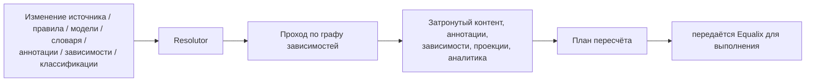

# Resolutor

## Что это

Resolutor — это компонент, который определяет, **что нужно изменить**. Получив изменение — источника,
правила, модели, словаря, аннотации, зависимости или классификации — Resolutor проходит по явному графу
зависимостей и формирует план пересчёта, называющий точно затронутые объекты. Сам он никогда ничего не
выполняет.

## Почему это существует

Как только знания становятся производными, а не создаются вручную (см. [§4.9](../design/synanton-design-1.25.md)),
кто-то должен ответить на вопрос «затронуто этим изменением: что именно?» прежде, чем будет запланирована
хоть какая-то работа. Если делать этот анализ на ходу, внутри той задачи, которая случайно отреагировала на
изменение, ответ будет не лучше понимания графа зависимостей этой конкретной задачей — а разные задачи со
временем расходятся во мнениях. Resolutor существует, чтобы сделать анализ влияния единственным,
детерминированным и независимо проверяемым шагом, на который опирается любая другая нагрузка, управляемая
изменениями, а не тем, что каждая из них выводит заново.

## Как это работает

Resolutor относится к графу зависимостей как к данным, а не как к тому, что нужно выводить логически. Он
берёт событие изменения, находит каждый узел графа, транзитивно зависящий от изменившегося, и формирует
план — список затронутых объектов, сгруппированных по типу. Он передаёт этот план [Equalix](equalix.ru.md)
и на этом останавливается; планирование, приоритизация, повторные попытки и ограничения ресурсов —
полностью забота Equalix. Resolutor детерминирован для данного графа зависимостей и набора изменений:
одно и то же изменение, повторно применённое к одному и тому же графу, даёт один и тот же план, а это и
позволяет пересчитывать план безопасно, а не доверять ему слепо.

Сам проход — это замыкание над графом зависимостей, а не эвристическая догадка о том, «что, вероятно, нужно
обновить». Если аннотация B объявляет зависимость от аннотации A, а A затронута, то и B затронута — без
исключений, независимо от того, насколько глубока цепочка и насколько несвязанной выглядит B на первый
взгляд. Именно это делает Матрицу изменений (см. [Пересчёт](recalculation.ru.md#матрица-изменений))
надёжным контрактом, а не правилом на глаз: Resolutor — это компонент, который фактически обеспечивает её
соблюдение, изменение за изменением, а не тем, чтобы матрица оставалась благим намерением в документации,
которое никто не проверяет.

Стоит явно проговорить, где заканчивается работа Resolutor, потому что эти две роли легко перепутать:
Resolutor отвечает на вопрос «что затронуто», Equalix — на вопрос «когда и в каком порядке затронутое
должно фактически быть пересчитано». Resolutor никогда не смотрит на глубину очереди, нагрузку тенанта или
ёмкость исполнителя — таких вопросов для него не существует. Equalix никогда не смотрит на граф
зависимостей — он получает план как непрозрачную единицу работы и планирует её. Ни один из компонентов не
может заменить другой, а их объединение лишило бы платформу возможности рассуждать о корректности анализа
влияния и безопасности выполнения независимо друг от друга.

## Пример

Определение аннотации `topic-classification` обновляется с версии v2 до v3. Resolutor находит все
аннотации, произведённые по v2, а затем идёт по рёбрам зависимостей вперёд, чтобы найти аннотации, которые
сами были выведены из них (например, нижестоящую аннотацию «риск эскалации», которая читает
`topic-classification`). План называет оба набора. Чанк, который никогда не был аннотирован
`topic-classification` v2, вообще не попадает в план — Resolutor не рассуждает о нём, и ничто ниже по
цепочке его не коснётся.

## Входные данные

Изменения источника, изменения извлечения, изменения чанкирования, изменения правил аннотаций, изменения
определений аннотаций, изменения моделей, изменения словарей, изменения зависимостей, изменения
классификации безопасности и изменения определений аналитики.

## Выходные данные

План пересчёта: затронутый контент, затронутые аннотации, затронутые зависимости, затронутые проекции и
затронутая аналитика — тот же словарь, которым [Матрица изменений](recalculation.ru.md#матрица-изменений)
описывает влияние.

## Преобразования

Никаких — над самими знаниями. Единственное преобразование Resolutor — превращение события изменения в
план влияния; он никогда не изменяет чанк, аннотацию, запись индекса или узел графа. Именно это разделение
делает его безопасным для повторного запуска: вычислить план дважды — бесплатно, а неверный план можно
поймать до того, как против него что-либо выполнится.

## Зависимости

Resolutor требует, чтобы [граф зависимостей](annotation-dependencies.ru.md) был явным и полным — неявную
или частично смоделированную зависимость невозможно пройти корректно, а пробел в ней становится тихим
недопересчётом. Он опирается на [Происхождение](../concepts/provenance.md), чтобы отслеживать, что из чего
было произведено, и передаёт свой результат [Equalix](equalix.ru.md) через стабильный интерфейс, описанный
в [Контрактах](contracts.md). Resolutor не зависит от Equalix или от какого-либо исполнителя для выполнения
собственной работы.

## Изменение и пересчёт

Планы Resolutor актуальны ровно настолько, насколько актуален граф зависимостей, по которому они вычислены
— когда сам граф меняется (регистрируется новое ребро зависимости или удаляется устаревшее), любой план,
вычисленный до этого изменения, следует считать замещённым, а не исправлять патчем. Поскольку анализ не
имеет побочных эффектов, пересчёт плана с нуля после изменения графа — нормальная, дешёвая реакция, а не
исключительная. Resolutor сам никогда не вызывает изменение; он только отвечает на то, что изменение
подразумевает.

## Безопасность

Результат Resolutor должен отражать то же различие «классифицируй один раз, авторизуй динамически», которое
управляет пересчётом в целом: изменение *логики* классификации безопасности — это настоящий вопрос анализа
влияния (Resolutor формирует план, потому что сама детекция изменилась), тогда как изменение *отображения*
группы на классификацию таковым не является — оно вообще не доходит до Resolutor как вопрос пересчёта,
потому что никакие сохранённые знания не устаревают. См. [Пересчёт → Безопасность](recalculation.ru.md#безопасность)
для полного разбора.

## Происхождение

Каждая запись в плане пересчёта несёт достаточно данных о происхождении, чтобы восстановить конкретное
изменение, которое её туда поместило — какая версия источника, какая версия правила, какая версия модели.
Именно это происхождение позволяет [Equalix](equalix.ru.md), а также любому, кто аудирует пересчёт позже,
ответить на вопрос «почему это было пересчитано?» без повторного вывода прохода по графу зависимостей с
нуля.

## Связанные концепции

[Пересчёт](recalculation.ru.md) · [Equalix](equalix.ru.md) ·
[Зависимости аннотаций](annotation-dependencies.ru.md) · [Происхождение](../concepts/provenance.md) ·
[Synanton Design 1.25](../design/synanton-design-1.25.md)
