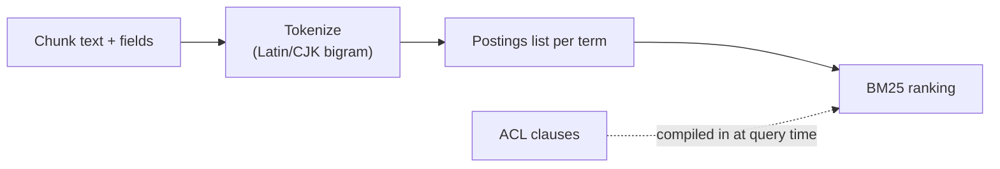

# Reverse Index

## What it is

The reverse index is the lexical projection of canonical knowledge: for every meaningful term, it keeps a
list of exactly which chunks contain it, how often, and how prominently — the same family of structure a
traditional search engine builds, implemented by `synquest`, Synanton's Rust-based search kernel.

## Why it exists

Exact search, lexical search, annotation filtering, classification filtering, and metadata filtering are all
things a reverse index is naturally good at and a vector store or graph is not. A part number, a rare legal
term, or an exact ID a user typed correctly needs an exact match, not a nearest-neighbor approximation — and
filtering by classification, tenant, or annotation value is a term lookup, not a similarity computation.

## How it works

Text is tokenized per language family — a standard tokenizer with stop-word removal for Latin-family text,
and an overlapping-character bigram tokenizer for CJK text, which doesn't rely on knowing where one word
ends and the next begins. Ranking uses BM25, a probabilistic relevance function that rewards terms that are
rare across the corpus but frequent in a specific chunk. Access control isn't a filter applied after
ranking: authorization clauses are injected as explicit filter terms at query-compile time, so a chunk the
caller can't see is never even scored — for tenants under the strictest security tier, this is enforced
through a filter structure that supports instant, atomic removal on permission revocation, so a revoked
grant takes effect immediately rather than waiting for a reindex.

## Example

A clause reading *"vendor shall notify buyer within 48 hours of an anticipated delay"* is found by a search
for "delivery," "deadline," and "vendor" because those terms — or close variants — appear directly in the
text. The same query's semantic cousin, a clause that never uses the word "deadline" at all, is a job for
the [vector store](vector-store.md), not the reverse index — this is the blind spot the two projections
cover for each other, walked through in [Search 101](../guides/overviews/search.md).

## Inputs

Chunk text (and its masked representation, where a dual representation exists), plus filterable fields:
annotations, security classification, tenant and source metadata.

## Outputs

Postings and filterable field entries, each keyed by `chunk_id`, ready to be combined with vector and graph
results during [fusion](../guides/overviews/search.md#how-the-results-get-combined).

## Transformations

Tokenization (including CJK bigram fallback and automatic language detection), stop-word removal, optional
stemming, and field indexing of annotation/classification/metadata values — all derived from the chunk,
none of it mutating it.

## Dependencies

Depends on chunk text and its annotation/classification fields being finalized before indexing; depends on
the authorization structures used to compile ACL clauses being kept in sync with grants and revocations, not
just with content.

## Change and recalculation

A chunk text or field change re-indexes only that chunk. Changing the tokenizer or analyzer configuration
(for example, enabling a new language's tokenization) requires re-indexing affected content, scoped to what
that change actually touches — see the [change impact model](recalculation.md#change-impact-model). A
permission revocation on a strict-tier tenant updates the access-control structure directly, without waiting
for any reindex at all.

## Security

Authorization is compiled into the query as filter clauses before any ranking happens, not applied as a
post-hoc filter on results — the same principle [Search 101](../guides/overviews/search.md#search-never-forgets-who-s-asking)
describes for search as a whole. A chunk with a masked and an original representation is indexed as two
separate entries, so a lexical match on sensitive text never surfaces the unredacted field to a caller who
isn't authorized to see it.

## Lineage

Every postings entry references the `chunk_id` it was derived from, so any lexical hit is traceable back to
canonical knowledge.

## Related concepts

[Knowledge Projections](knowledge-projections.md) · [Vector Store](vector-store.md) · [Graph](graph.md) ·
[Search 101](../guides/overviews/search.md) · [Security-Aware Search](../concepts/security-aware-search.md)
