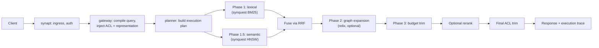

# Search Architecture

## What it is

Search architecture is the query execution path that turns a request into ranked, authorized results:
compilation, a multi-phase execution plan, fusion, optional reranking, and response — all evaluated
together rather than as independent stages.

## Why it exists

A useful enterprise search has to combine exact/lexical matching, semantic similarity, and relationship
context in a single query, at acceptable latency, without ever bypassing authorization. Treating any one
of those as a bolt-on afterthought produces search that's either incomplete or unsafe. The architecture
exists to make the combination itself — not any single retrieval technique — the unit of design.

## How it works

The canonical model runs lexical and semantic retrieval as parallel phases, fused by Reciprocal Rank
Fusion so an exact-term hit and a semantically-similar hit are ranked on a comparable scale. An optional
graph-expansion phase uses the fused top candidates as seed nodes for relationship traversal. A budget
phase trims the candidate set to the query's context budget before any reranking, preserving rank order.
Every plan carries a unified `CandidateScore { lexical_score, semantic_score, graph_score, combined_score }`
so cross-phase comparisons stay meaningful.

Reranking is a separate, fail-open step: if the reranker is unavailable, the gateway returns un-reranked
hits with a warning header rather than failing the query — reranker outage never cascades into search
outage.

## Example

A query for "invoice 4471 payment dispute" runs lexical matching on the invoice number, semantic matching
on the concept of a dispute, and — if graph expansion is enabled — traverses from the matched invoice to
its customer and any related support ticket. All three signal types are fused into one ranked list before
the caller's authorization is used to select the correct representation for each hit.

## Inputs

A query, the caller's authorization context, and the [knowledge projections](knowledge-projections.md)
(reverse index, vector store, graph).

## Outputs

A ranked, authorized result set plus an execution trace — plan, cost, rerank outcome, and any degraded-mode
warnings — attached to the response.

## Transformations

Query compilation (natural language or structured input → `SearchQuery` with ACL and representation
clauses injected), multi-phase execution, RRF fusion, optional reranking, final ACL trim as defense in
depth.

## Dependencies

Depends on [Security-Aware Search](security-aware-search.md) for representation selection at compile
time, and on the [Reverse Index](reverse-index.md), [Vector Store](vector-store.md), and
[Graph](graph.md) being current.

## Change and recalculation

A ranking algorithm, fusion parameter, or reranker change affects results without any change to canonical
knowledge. A degraded-mode condition (e.g. the embedding model temporarily unavailable) skips the semantic
phase and flags the response accordingly, rather than failing the query outright.

## Security

ACL and representation clauses are injected at compile time, before any candidate is gathered — see
[Security-Aware Search](security-aware-search.md). A final-pass ACL trim on the top-N results exists as
defense in depth, not as the primary enforcement mechanism.

## Lineage

Every hit is traceable to its source chunk; the execution trace itself records which plan, phases, and
representation decisions produced the response.

## Related concepts

[Security-Aware Search](security-aware-search.md) · [Knowledge Projections](knowledge-projections.md) ·
[Reverse Index](reverse-index.md) · [Vector Store](vector-store.md) · [Graph](graph.md) ·
[Search overview](../guides/overviews/search.md)
