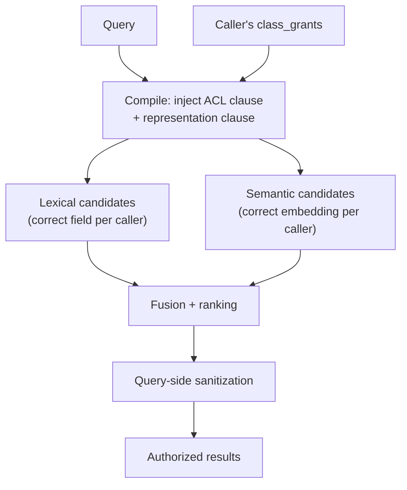

# Security-Aware Search

## What it is

Security-aware search is the compile-time enforcement of classification and masking inside query
execution itself — a representation clause injected alongside the resource-ACL clause, before ranking
statistics are computed, not a filter applied to results afterward.

## Why it exists

A post-filter approach — run the query, then strip results the caller can't see — leaks information
through term statistics, hit counts, and ranking signals even when it never returns forbidden content
directly. An unauthorized caller can infer a restricted term exists just by observing how it shifts
relevance scores. Compiling representation selection into the query before any statistics are gathered
closes that channel.

## How it works



```text
Before: Must(org_id=acme, space_id=finance)
After:  Must(org_id=acme, space_id=finance, class IN ('FINANCIAL', 'PUBLIC'))
        → representation = ORIGINAL for FINANCIAL-classified chunks, MASKED otherwise
```

For a Dual-representation chunk, an authorized caller's compiled query targets `content_original` /
`embedding_original`; an unauthorized caller's targets `content_masked` / `embedding_masked` — the chunk is
never excluded, its masked field is fully searchable. For Masked-only chunks, every caller resolves to
`content_masked`, because no original field exists to select. This reaches lexical term statistics,
semantic vector candidates, and the ACL pre-filter alike, for every tenant tier — not only high-security
ones.

## Example

An `hr` role searching "gross income" against a Dual-representation `FINANCIAL` chunk gets a hit whose
snippet reads `[REDACTED:FINANCIAL]`. A `payroll` role's identical search on the same chunk gets the
actual figure. Neither query was filtered after the fact — each was compiled to target a different field
from the start.

## Inputs

A query, the caller's authorization context (resource ACL + `class_grants`), and classified/masked chunks
from every [knowledge projection](knowledge-projections.md).

## Outputs

Authorized, ranked results where every hit's representation was correct from the moment candidates were
gathered.

## Transformations

Query compilation injects representation-aware clauses. Query-side sanitization extends the same
principle to suggest/autocomplete and anomaly logging: neither may reveal a restricted term the caller
couldn't otherwise see.

## Dependencies

Depends on [Security](security.md) and [Masking](masking.md) having already decided each chunk's
representation outcome, and on every [knowledge projection](knowledge-projections.md) having propagated
that outcome consistently.

## Change and recalculation

A `class_grants` mapping change affects authorization at the next query, with no content recalculation. A
classification or masking policy change requires reprocessing affected chunks — see
[Masking](masking.md#change-and-recalculation).

## Security

This is the enforcement layer for everything [Security](security.md) and [Masking](masking.md) decide.
Highlight snippets render from the representation actually selected for the caller — never fall back to
an unauthorized representation for display purposes.

## Lineage

Every result remains traceable to its source chunk; representation selection itself is recorded as part of
query execution, not just chunk state.

## Related concepts

[Security](security.md) · [Masking](masking.md) · [Search Architecture](search-architecture.md) ·
[Security-Aware Search (concept)](../concepts/security-aware-search.md)
