# Security

## What it is

Security classification and authorization together decide two separate questions: how sensitive a chunk
is, and who is currently allowed to see it. The architecture evaluates both, at chunk granularity, as
`resource_acl ∧ class_grants` — never either control alone.

## Why it exists

A resource-centric security model (`SPACE | PROJECT | FOLDER | DOCUMENT`) cannot express sub-document
sensitivity: a single contract PDF containing identity data, personal contact details, and financial terms
must be searchable by different roles without exposing the restricted spans to any of them. Chunk-level
classification exists to close that gap, and to do so without coupling classification to a specific
authorization mapping that changes far more often than content does.

## How it works

```mermaid
flowchart TD
    Chunk[Semantic chunk] --> Detect[Deterministic classification detectors]
    Detect --> Class["classification&#91;&#93; on chunk<br/>(content state)"]
    Grants[class_grants: role/group to class] --> Policy[Security policy]
    Class --> Policy
    Policy --> Auth["Authorization decision<br/>(evaluated per query)"]
```

Detectors — pattern/regex rules, gazetteers, table-header rules — run over a chunk's structured elements
before it is committed to any store, and assign `classification[]` deterministically. Authorization is a
separate evaluation: current `class_grants` mapping, joined against the chunk's classification, decided
fresh at query time. See [Security Classification](../concepts/security-classification.md) for the
conceptual model this implements.

## Example

A payroll table chunk is detected as `FINANCIAL`. The `PAYROLL` role holds a `FINANCIAL` grant; `HR_GENERALIST`
does not. When `HR_GENERALIST`'s grants change next quarter — gaining or losing `FINANCIAL` — nothing about
the chunk changes. The next query from that role evaluates the new grant against the unchanged
classification.

## Inputs

Chunk content and structure (for classification detection); the current `class_grants` mapping (for
authorization).

## Outputs

A `classification[]` value stored with the chunk, and a per-query authorization decision that is never
itself persisted as chunk state.

## Transformations

Classification detection is deterministic and auditable. Authorization evaluation has no side effects on
content — it only gates what a given query is allowed to retrieve.

## Dependencies

Depends on [Chunk Security](../concepts/chunk-security.md) classification having run, and on a policy
store maintaining `class_grants` independently of content. [Masking](masking.md) depends on the
classification decision made here.

## Change and recalculation

A classification **logic** change (a new detector, a new pattern) requires re-running detection over
affected chunks. A `class_grants` **mapping** change requires no content recalculation at all — see
[Classify Once, Authorize Dynamically](../concepts/security-classification.md#how-it-works) — only a fresh
authorization evaluation at the next query. See the [change impact model](recalculation.md#change-impact-model).

## Security

This page is itself the security architecture. Masking and representation selection extend it — see
[Masking](masking.md) and [Security-Aware Search](security-aware-search.md).

## Lineage

Every classification decision records the detector, its version, and the exact chunk content evaluated —
see [Provenance](../concepts/provenance.md).

## Related concepts

[Security Classification](../concepts/security-classification.md) · [Masking](masking.md) ·
[Security-Aware Search](security-aware-search.md) · [Security Guides](../guides/security/index.md)
