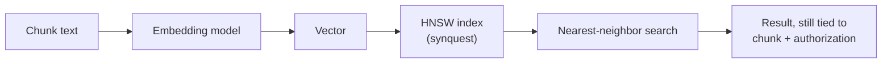

# Vector Store

## What it is

The vector store is the semantic projection of canonical knowledge: every chunk is turned into a point in a
high-dimensional space, positioned so that chunks with similar *meaning* end up near each other regardless
of the specific words used, and indexed for fast nearest-neighbor search.

## Why it exists

Lexical search is blind to paraphrase — "end the agreement" and "terminate this contract" share almost no
vocabulary but mean the same thing. Semantic similarity search exists to cover exactly that blind spot,
finding chunks that are *about* a query even when they don't share a single word with it.

## How it works

An embedding model turns chunk text into a vector; the same model turns a query into a vector the same way,
and the search finds the nearest neighbors using a hierarchical navigable small-world (HNSW) index — an
approximate but fast nearest-neighbor structure. Recall (how close the approximate result is to a true
exhaustive search) is continuously sampled against a shadow exhaustive search, and per-tenant index
parameters are tuned automatically rather than hand-edited when recall drifts.

If GPU capacity for the primary embedding model is saturated or temporarily unavailable, the platform falls
back to a smaller, CPU-friendly embedding model rather than skipping semantic search altogether; if even
that isn't feasible, search proceeds lexical-only, with the degraded state flagged rather than hidden — see
[Search 101](../guides/overviews/search.md#what-happens-when-things-aren-t-running-at-full-strength).

## Example

A query for *"rules for ending an agreement"* finds a clause reading *"either party may terminate this
contract"* — the two sentences share almost no vocabulary, but the embedding model places them close
together in meaning-space. The same technique works across languages: an embedding model trained to place
semantically similar text near each other regardless of language lets a query in one language surface a
relevant chunk written in another.

## Inputs

Chunk text (and its masked representation, where a dual representation exists), plus the embedding model's
identity and version.

## Outputs

One vector per chunk representation, keyed by `chunk_id`, carrying a reference to the chunk's authorization
metadata alongside it — never a bare, unattributed point in space.

## Transformations

Embedding inference: a single forward pass through the configured embedding model, from chunk text to a
fixed-length vector. Insertion into the HNSW index is a structural operation on top of that vector, not a
transformation of the content itself.

## Dependencies

Depends on the configured embedding model's availability and version being stable and known; a model
change is a first-class, trackable event, not a silent drift. Depends on chunk text being finalized before
embedding, the same as for the [reverse index](reverse-index.md).

## Change and recalculation

Changing the embedding model version invalidates the vectors it produced and requires re-embedding affected
chunks — scoped to what actually used that model, not a platform-wide rebuild — see the
[change impact model](recalculation.md#change-impact-model). A degraded-mode fallback embedding (used
temporarily under GPU pressure) is tracked as a lower-quality result so it can be re-embedded with the
primary model once capacity returns, rather than being silently treated as equivalent forever.

## Security

A vector is never sufficient on its own to decide who can see the chunk it represents — every vector
carries a reference to its chunk's classification and authorization metadata, so access is enforced at
query time from that reference, never inferred from the embedding's position in space. Where a chunk has a
masked and an original representation, both are embedded and indexed separately, so a semantic match can
resolve to either the redacted or unredacted result depending on who's asking — the same principle
[Search 101](../guides/overviews/search.md#search-never-forgets-who-s-asking) describes for search as a
whole.

## Lineage

Every vector references the `chunk_id` and embedding model version that produced it, so a semantic match is
always traceable back to canonical knowledge and to the specific model that generated the match.

## Related concepts

[Knowledge Projections](knowledge-projections.md) · [Reverse Index](reverse-index.md) · [Graph](graph.md) ·
[Search 101](../guides/overviews/search.md) · [Security-Aware Search](../concepts/security-aware-search.md)
