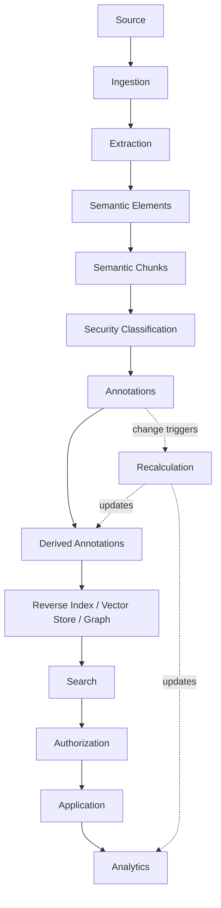

# How Data Flows Through Synanton

This page follows a single piece of content from source to analytics, through every transformation Synanton
applies to it. For each step, the same six questions apply: **what changes, why is it needed, what causes
it, what remains stable, can it be recalculated, and is it observable through analytics.**

```text
Source
 ↓
Ingestion
 ↓
Extraction
 ↓
Semantic Elements
 ↓
Semantic Chunks
 ↓
Security Classification
 ↓
Annotations
 ↓
Derived Annotations
 ↓
Embeddings / Relationships
 ↓
Reverse Index · Vector Store · Graph DB
 ↓
Search
 ↓
Authorization
 ↓
Application
 ↓
Analytics
```

## Source → Ingestion

A document, image, audio or video file (or an already-structured record, such as a ticket) enters the
platform. **What changes:** nothing about the content yet — ingestion establishes identity, tenancy and
provenance. **What remains stable:** the source itself is never mutated. See [Ingestion](../architecture/ingestion.md).

## Ingestion → Extraction → Semantic Elements

The [Extraction Plane](../architecture/extraction-plane.md) recovers the document's actual structure —
headings, paragraphs, tables, pages, speakers, timestamps, scenes — into media-independent
[semantic elements](../concepts/semantic-elements.md). **What causes it:** new or changed source content, or
a change to extraction logic itself. **Can it be recalculated:** yes — re-extraction only, without touching
annotation or security state.

## Semantic Elements → Semantic Chunks

[Semantic chunking](../concepts/semantic-chunking.md) groups elements into independently addressable
**[chunks](../concepts/chunks.md)** — following the document's own structure rather than fixed token
windows. **What remains stable:** a chunk's identity persists across re-chunking when its underlying
structure hasn't changed, which is what lets annotations and index entries survive minor re-processing.

## Semantic Chunks → Security Classification

Each chunk may receive a **[security classification](../concepts/security-classification.md)** before
anything else happens to it. **Why it's needed:** classification has to exist before annotation, indexing,
or embedding, so that no downstream store is ever populated with content that hasn't yet been classified.

## Security Classification → Annotations → Derived Annotations

**[Annotations](../concepts/annotations.md)** — tags, classifications, entities, attributes, signals — are
added by rules, dictionaries, models, LLMs or humans. Some annotations are **derived** from others (see
[Annotation Dependencies](../concepts/annotation-dependencies.md)), forming a dependency graph that later
makes targeted [recalculation](../architecture/recalculation.md) possible instead of a full rebuild.

## Annotations → Embeddings / Relationships → Knowledge Projections

The same chunk is projected into whichever stores serve its workloads: a **reverse index** for exact/lexical
retrieval, a **vector store** for semantic similarity, and a **graph** for relationships — see
[Knowledge Projections](../concepts/knowledge-projections.md). **What remains stable:** the canonical
chunk and its annotations; the projections are derived and, in principle, rebuildable from them.

## Knowledge Projections → Search → Authorization → Application

[Search](../concepts/search.md) combines lexical, semantic and relationship retrieval, filtered by
[security-aware authorization](../concepts/security-aware-search.md) *as part of* the query — never as a
post-filter — before results reach an application. **What causes re-evaluation:** every search, since
authorization is evaluated dynamically from current policy, not baked into stored content.

## Application → Analytics

Every step above emits observable activity — an [Analytics Plane](../architecture/analytics-plane.md) event
— which becomes an analytical fact, aggregate, metric and report. **What remains authoritative:** the
knowledge model itself. Analytics observes it; it never replaces it. See [Analytics](../concepts/analytics.md).

## The complete picture



## Related concepts

[What is Synanton?](../concepts/synanton.md) · [Architecture Overview](../architecture/overview.md) ·
[Recalculation](../architecture/recalculation.md) · [Change Matrix](../architecture/recalculation.md#change-matrix)
