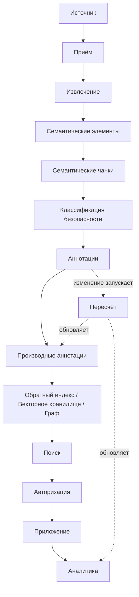

# Как данные проходят через Synanton

Эта страница прослеживает путь одной единицы контента от источника до аналитики через каждое
преобразование, которое Synanton к нему применяет. Для каждого шага действуют одни и те же шесть вопросов:
**что меняется, зачем это нужно, что это вызывает, что остаётся стабильным, можно ли это пересчитать и
наблюдаемо ли это через аналитику.**

```text
Источник
 ↓
Приём (Ingestion)
 ↓
Извлечение
 ↓
Семантические элементы
 ↓
Семантические чанки
 ↓
Классификация безопасности
 ↓
Аннотации
 ↓
Производные аннотации
 ↓
Векторизация / Связи
 ↓
Обратный индекс · Векторное хранилище · Граф
 ↓
Поиск
 ↓
Авторизация
 ↓
Приложение
 ↓
Аналитика
```

## Источник → Приём

Документ, изображение, аудио- или видеофайл (либо уже структурированная запись, например тикет) поступает
в платформу. **Что меняется:** пока ничего в самом контенте — приём устанавливает идентичность, принадлежность
к тенанту и происхождение. **Что остаётся стабильным:** сам источник никогда не изменяется. См.
[Приём](../architecture/ingestion.md).

## Приём → Извлечение → Семантические элементы

[Уровень извлечения](../architecture/extraction-plane.md) восстанавливает реальную структуру документа —
заголовки, абзацы, таблицы, страницы, спикеров, временные метки, сцены — в независимые от типа носителя
[семантические элементы](../concepts/semantic-elements.md). **Что это вызывает:** новый или изменённый
исходный контент, либо изменение самой логики извлечения. **Можно ли пересчитать:** да — только повторное
извлечение, без затрагивания состояния аннотаций или безопасности.

## Семантические элементы → Семантические чанки

[Семантическое чанкирование](../concepts/semantic-chunking.md) группирует элементы в независимо адресуемые
**[чанки](../concepts/chunks.md)** — следуя структуре самого документа, а не окнам фиксированной длины.
**Что остаётся стабильным:** идентичность чанка сохраняется при повторном чанкировании, если его базовая
структура не изменилась, — именно это позволяет аннотациям и записям индекса переживать незначительную
переобработку.

## Семантические чанки → Классификация безопасности

Каждый чанк может получить **[классификацию безопасности](../concepts/security-classification.md)** прежде,
чем с ним произойдёт что-либо ещё. **Зачем это нужно:** классификация должна существовать до аннотирования,
индексирования или векторизации, чтобы ни одно нижестоящее хранилище никогда не получало неклассифицированный
контент.

## Классификация безопасности → Аннотации → Производные аннотации

**[Аннотации](../concepts/annotations.md)** — теги, классификации, сущности, атрибуты, сигналы — добавляются
правилами, словарями, моделями, LLM или людьми. Некоторые аннотации **производны** от других (см.
[Зависимости аннотаций](../concepts/annotation-dependencies.md)) и образуют граф зависимостей, который
впоследствии делает возможным целевой [пересчёт](../architecture/recalculation.md) вместо полной
перестройки.

## Аннотации → Векторизация / Связи → Проекции знаний

Один и тот же чанк проецируется в те хранилища, которые обслуживают его рабочие нагрузки: **обратный
индекс** для точного/лексического поиска, **векторное хранилище** для семантического сходства и **граф**
для связей — см. [Проекции знаний](../concepts/knowledge-projections.md). **Что остаётся стабильным:**
канонический чанк и его аннотации; проекции производны и в принципе восстановимы из них.

## Проекции знаний → Поиск → Авторизация → Приложение

[Поиск](../concepts/search.md) объединяет лексический, семантический и связевой поиск, отфильтрованный по
[авторизации с учётом безопасности](../concepts/security-aware-search.md) *как часть* самого запроса —
никогда как постфильтр — прежде чем результаты попадут в приложение. **Что вызывает переоценку:** каждый
поиск, поскольку авторизация вычисляется динамически из текущей политики, а не «зашита» в сохранённый
контент.

## Приложение → Аналитика

Каждый из шагов выше порождает наблюдаемую активность — событие [Уровня аналитики](../architecture/analytics-plane.md)
— которое становится аналитическим фактом, агрегатом, метрикой и отчётом. **Что остаётся источником
истины:** сама модель знаний. Аналитика наблюдает за ней; она никогда её не заменяет. См.
[Аналитику](../concepts/analytics.md).

## Полная картина



## Связанные концепции

[Что такое Synanton?](../concepts/synanton.ru.md) · [Обзор архитектуры](../architecture/overview.ru.md) ·
[Пересчёт](../architecture/recalculation.md) · [Матрица изменений](../architecture/recalculation.md#change-matrix)
