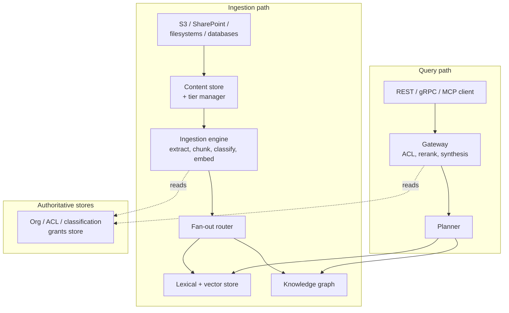
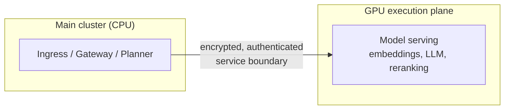
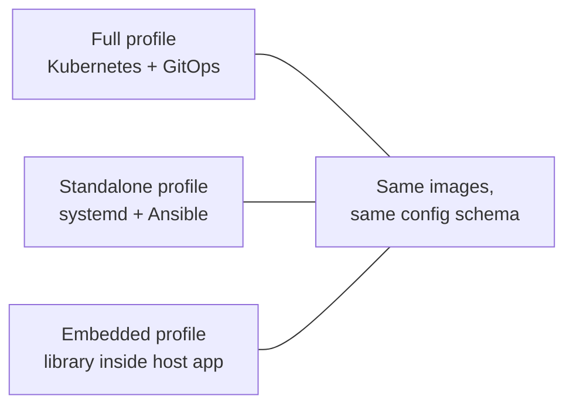

# Deployment: High-Level Topology and Data Flows

**Audience:** platform engineers, IT decision-makers, and partners who need to understand *where things run* and *what changes between deployment options* — without Kubernetes manifests or Ansible playbooks.

## The shape of the platform

Synanton is a set of independently-deployable services, not a monolith. Content flows in one direction through an ingestion path, and queries flow through a separate path that reads what ingestion produced — the two paths share stores, but neither blocks on the other in normal operation.

Two authoritative stores sit outside both paths and are consulted by each: the organization/permissions store (who exists, what they can access — covered in [Security 101](security.md)) and the model-serving layer that both ingestion and query use for LLM and embedding calls without needing to know exactly where those models are physically running.

## The GPU cluster is a separate plane, on purpose

One topology decision is worth calling out explicitly because it surprises people expecting a single, uniform cluster: GPU-backed inference (embeddings, LLM enrichment, reranking, answer synthesis) runs on a **separately-scaled, separately-owned cluster**, connected to the main platform over an encrypted, authenticated network boundary — not baked into the same nodes that run search and ingestion.

This split exists for two independent reasons. First, GPU capacity has a fundamentally different cost and scaling profile than the rest of the platform — it makes sense to scale it up and down on its own schedule rather than tying every service's hardware footprint to whatever the busiest GPU workload needs. Second, and just as important: if the GPU plane is saturated, degraded, or entirely down, the rest of the platform is designed to keep working in a reduced-capability mode (see "Degraded mode" below) rather than going down with it. Ingestion and search have a *dependency* on GPU capacity for full quality, not a *hard requirement* for basic availability.

## Three deployment profiles

Synanton ships as the same set of service images regardless of how you run them — what changes between profiles is the orchestration layer underneath, not the application logic itself.

| Profile | How it's orchestrated | Best fit |
|---|---|---|
| **Full** (default) | Kubernetes, with configuration changes rolled out through a GitOps pipeline | Organizations already running Kubernetes, or that need the full elasticity/auto-scaling story |
| **Standalone** | systemd services provisioned by Ansible — no Kubernetes at all | Teams that want the platform's full capability without taking on Kubernetes operational overhead |
| **Embedded** | The platform runs as a library inside a host application's own process | Products that want to bundle Synanton's search/ingestion capability directly rather than run it as a separate service |

The same container images and the same configuration schema apply across all three — the difference is entirely in *what launches, restarts, and scales* the services, not in what the services do once running. Standalone deployments even get an equivalent to Kubernetes' rolling restarts and load rebalancing, implemented as a lightweight sidecar process rather than depending on Kubernetes' scheduler to provide it. Embedded deployments support upgrading the underlying index format without downtime, using a shadow-index technique: a new index is built alongside the running one and swapped in atomically once ready, rather than taking the host application offline to migrate.

## Tenant isolation: two tiers, one decision to make per customer

Multi-tenancy — multiple organizations' data living in the same platform, kept strictly separate — comes in two isolation strengths, chosen per tenant rather than platform-wide:

| Aspect | `STANDARD` tier | `HIGH_SECURITY` tier |
|---|---|---|
| Data isolation | Logical (shared infrastructure, tenant-scoped by identifier) | Physical (dedicated storage partitions per tenant) |
| Cross-tenant result caching | Enabled, for cost efficiency on shareable content | Disabled entirely |
| Access-control enforcement path | Standard filtering | Additional fast, defense-in-depth pre-filter applied to every query, with no exceptions |
| Permission-change propagation | Standard (asynchronous, near-real-time) | Synchronous — a revoked grant is guaranteed in effect before the change is acknowledged |

Choosing `HIGH_SECURITY` for a tenant costs some of the cross-tenant efficiency gains (shared caching in particular), and it's the right trade for regulated industries or customers with contractual data-isolation requirements. `STANDARD` is the right default for the common case where logical isolation and asynchronous propagation are more than sufficient, and the efficiency gains matter.

## Data residency: keeping data where it's allowed to be

Every tenant can have a residency policy that names which geographic regions its data and processing are allowed to touch. When a query would need to reach outside that boundary — because the nearest available capacity for some resource happens to sit in a disallowed region, say — the platform has two configurable behaviors: **fail closed** (refuse the query outright with a clear "this would violate your residency policy" response) or **fail open with a warning** (drop the out-of-region option and proceed, flagging that a residency boundary constrained the result). Which behavior applies is a per-tenant policy choice, not a platform-wide default — a regulated customer typically wants fail-closed; a customer using residency purely as a latency-optimization hint typically wants fail-open.

The same regional awareness extends to model serving: a global deployment can route embedding and LLM inference to follow demand across time zones (serving European traffic from European capacity during European business hours, for instance) without that routing ever crossing a tenant's declared residency boundary.

## Degraded mode: designed to bend, not break

Both the CPU-side platform and the GPU execution plane can fail independently of each other, and the platform is explicitly designed around that independence rather than assuming both are always healthy together. If GPU capacity is unavailable or saturated:

- Ingestion falls back to a smaller, CPU-compatible embedding model, and if even that isn't feasible, proceeds with lexical-only indexing rather than blocking — every affected item is flagged so it can be upgraded automatically once capacity returns.
- Query-time semantic search and reranking degrade the same way, with a response flag rather than a silent quality drop, and answer synthesis (which needs an LLM) is disabled with a clear "temporarily unavailable" signal rather than an error that looks like a bug.

This "fail visibly, not silently" philosophy is deliberate and repeated everywhere in the platform's design — a component that's struggling should say so, not quietly produce a worse answer that looks the same as a good one.

## A practical way to think about sizing

Deployment sizing genuinely scales with three largely independent dimensions: how much content you're ingesting (drives storage and ingestion throughput), how much query traffic you're serving (drives the search and gateway tiers), and how much LLM-dependent capability you're using — enrichment during ingestion, synthesis and reranking during query (drives GPU plane sizing specifically). A deployment that ingests a huge volume of content but serves comparatively little live search traffic has a very different shape than one doing the reverse, and the platform's separation of these concerns into independently-scalable services is what makes that difference expressible rather than forcing one uniform cluster shape regardless of actual workload.

## Choosing a profile: the questions that actually decide it

The three deployment profiles aren't ranked best-to-worst — they answer different constraints:

- **Do you already run Kubernetes, and want the platform to participate in your existing GitOps workflow?** Full profile is the natural fit, and it's the one the platform's own scaling and self-healing behavior is built around most directly.
- **Do you want the platform's full feature set without taking on Kubernetes as new operational surface area?** Standalone gets you the same services and the same configuration model, run by more familiar tooling (systemd, Ansible), at the cost of some of Kubernetes' automatic scheduling conveniences — which the platform compensates for with its own lightweight rebalancing.
- **Are you building a product that should feel like it has search and ingestion "built in," rather than depending on a separately-run service?** Embedded mode runs the platform as a library inside your own application process — no separate service to operate at all, at the cost of running within your application's own resource envelope rather than an independently scalable cluster.

A given organization can also legitimately run different profiles for different environments — Standalone for a lightweight staging environment, Full for production — because the configuration schema doesn't change between them.

## What operators actually watch day to day

Regardless of deployment profile, the platform exposes the same operational signals: per-service health and latency metrics, ingestion pipeline throughput and backlog, and a set of alerts specifically designed to catch the failure modes this guide and [Security 101](security.md) describe — a GPU-degraded-mode window running longer than expected, a tenant's isolation-tier guarantee being violated, a permission propagation delay exceeding its SLA. None of that requires deployment-profile-specific tooling; the same dashboards and alert definitions apply whether the underlying orchestration is Kubernetes, systemd, or an embedded process. [Troubleshooting 101](troubleshooting.md) walks through what to do when one of those signals fires.

## Backup and disaster recovery, at a glance

Different stores have different recovery expectations, because they hold different kinds of data with different regeneration costs. Content that can be re-derived from the original source document (a search index entry, a cached embedding) has a more relaxed recovery target than content that has no other copy anywhere (the raw source document itself, and the authoritative permissions/organization store). The platform's default posture is active-passive across regions for the stores that matter most for continuity — a secondary region stands ready to take over, rather than every region actively serving all traffic simultaneously — which keeps the failover story simple at the cost of not using secondary-region capacity for day-to-day load. Exact recovery time and recovery point targets differ by storage class and are documented in the capacity planning appendix linked below, not repeated here — they're the kind of number that needs to stay in one authoritative place rather than being restated (and risk drifting) across multiple documents.

## Frequently asked questions

**Can we mix isolation tiers — some tenants `STANDARD`, some `HIGH_SECURITY` — in the same deployment?**
Yes, that's the intended usage pattern. Isolation tier is a per-tenant setting, not a whole-deployment choice, so a single platform instance can serve both a regulated customer on `HIGH_SECURITY` and a cost-sensitive customer on `STANDARD` side by side.

**If we start on Standalone, can we migrate to Full later without re-ingesting everything?**
Yes — because both profiles run the same images against the same data model, migrating orchestration layers is an infrastructure change, not a data migration. The content, indexes, and graph don't need to be rebuilt just because the orchestrator underneath them changed.

**Does losing GPU capacity mean losing search entirely?**
No — this is exactly what degraded mode exists to prevent. Lexical (keyword) search keeps working even with the GPU plane fully down; what's lost is semantic search quality and answer synthesis, both restored automatically once GPU capacity returns, with previously-degraded content quietly upgraded in the background.

**Do we need to run our own GPU infrastructure, or is that offered as a managed service?**
That's a deployment-time choice independent of which of the three orchestration profiles you pick — the GPU execution plane's contract is designed so it can be self-hosted or consumed as an externally-managed service, without the rest of the platform needing to know which.

## Go Deeper

| Question | Document |
|---|---|
| What's the exact module-by-module topology and every service's responsibilities? | `docs/architecture/synanton-design-1.22.md` §4 (System Topology), §5 (Module Map) |
| What are the precise isolation-tier mechanics and per-tenant resource partitioning rules? | `docs/architecture/synanton-design-1.22.md` §41 (Multi-Tenancy and Isolation Tiers) |
| How exactly is data residency enforced, and what's the cross-region latency model? | `docs/architecture/synanton-design-1.22.md` §43 (Cross-Region & Data Residency) |
| What's the full deployment-profile mechanics (Ansible roles, GitOps pipeline, shadow-index migration)? | `docs/architecture/synanton-design-1.22.md` §46 (Deployment Profiles) |
| Why is the GPU plane a separate repository and ownership boundary? | `docs/architecture/synanton-design-1.22.md` §50–§53 |
| What are the disaster-recovery RTO/RPO targets per storage class? | `docs/architecture/synanton-design-1.22.md` §47a (Disaster Recovery) |
| How do I size a cluster for N documents or N queries/second? | `docs/architecture/synanton-design-1.22.md`, Appendix A (Capacity Planning Guide) |
| How do I actually run a demo or development deployment? | `README.md` ("Ingestion demo," "Full demo stack") |
