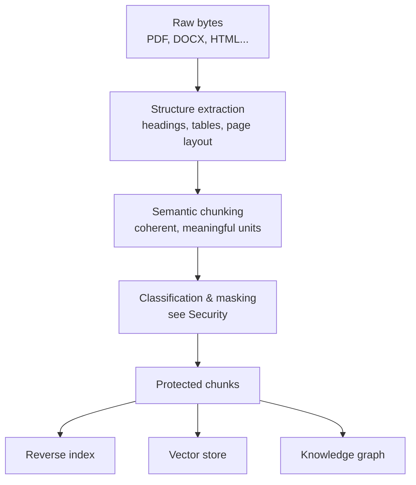
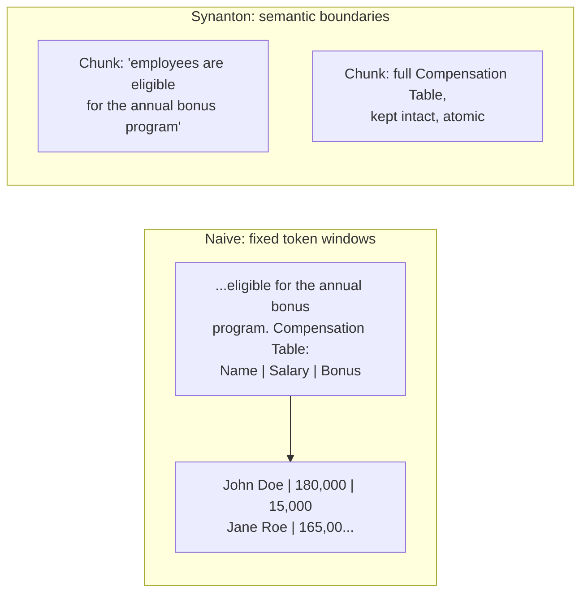

# Ingestion: Why Chunking and Structure Matter

**Audience:** anyone who wants to understand how a raw document becomes searchable knowledge — and why that process is more involved than "read the file and index the text."

## The short version

A PDF or a Word document isn't text — it's a *rendering* of text, tables, headings, and images that happens to be recoverable if you know how to look. Before any of it can be searched intelligently, Synanton has to answer two questions in order: *what is actually in this document, and how is it organized?* and then *what are the coherent, meaningful pieces inside it?* Getting both answers right — before classification, before embedding, before indexing — is most of what separates useful search from a system that technically "indexed the file" but returns garbled, out-of-context fragments.

## Structure first: what's actually in this document?

Before anything is chunked or indexed, a dedicated extraction step figures out the document's actual shape: which text belongs to which heading, which numbers form a table versus which are just numbers that happen to be near each other, where page boundaries fall, and where an image sits relative to the text around it. This step deliberately says nothing about *how* it produces that answer — which parser ran, whether OCR was involved, whether the work happened on a CPU or a GPU accelerator are all invisible below this layer. That's a deliberate design choice: it lets the underlying extraction technology evolve — swap a parser, add OCR support for scanned documents, add an entirely new format — without any of the search, security, or ranking logic downstream needing to change.

If this extraction step is temporarily unavailable, or doesn't support a given document type, the pipeline doesn't stop — it falls back to a simpler, local extraction path rather than blocking ingestion outright. The system would rather ingest at reduced quality, visibly flagged, than not ingest at all. This is the same philosophy [Search 101](search.md) describes for query-time degraded modes: a broken component should make things worse, not make things stop.

## Why not just split every N words?

The most naive way to prepare a document for search is to slice it into fixed-size windows — every 500 words, say — and index each window independently. This is cheap to implement and catastrophic for quality, for a simple reason: **meaning doesn't respect arbitrary boundaries.**

A fixed-size split can:

- Sever a table in the middle of a row, so neither half means anything on its own, and a search for a specific figure returns half a row with no context for what it represents.
- Separate a heading from the very paragraph it introduces, so a search hit shows body text with no indication of what section — or what topic — it belongs to.
- Cut a legal clause in half at exactly the point where "the following exceptions apply" meets the list of exceptions, so the retrieved fragment reads as an unqualified statement that's actually conditional.

Synanton's rule inverts the usual priority:

> **Semantic boundaries first. Token or word-count limits are a fallback, not the primary rule.**

The chunker works from the *structure* identified in the previous step — sections, paragraphs, list items, tables — rather than from flattened text. It follows the document's own hierarchy, only splitting a section at a paragraph or list boundary when that section is too large to handle as one piece, and even then, it never severs those boundaries arbitrarily. A table is treated as **atomic** — it is never split mid-row or mid-column just because it happened to be long. It's kept together and given a structured representation that a search or embedding step can work with directly, rather than being flattened into a wall of numbers stripped of the labels that gave them meaning.

The naive approach on the left severs a table mid-row for no reason other than word count; the row is now split across two independently-retrievable, independently-ranked fragments that neither means much alone. The semantic approach keeps the sentence and the table as two separate, individually coherent chunks — each one is a complete, meaningful unit on its own.

## What a chunk actually carries

A chunk isn't just a string of text — it's a small structured record that carries everything needed to use it safely and cite it precisely:

| Field | What it's for |
|---|---|
| A stable identifier | Lets every downstream store (search index, vector store, graph) refer to the same unit consistently |
| Its position in the document's outline | Lets a search result cite "§3.1 GPU Execution Plane" instead of just "page 14 of a 40-page PDF" |
| The actual content | What gets embedded, indexed, and (per [Security 101](security.md)) classified |
| A pointer back to the original structural elements it came from | Lets the platform prove, later, exactly where a piece of knowledge originated |
| Page range | Supports citation and audit |
| Sensitivity classification | Added during the security processing stage — a property of the chunk, not the whole document |

The provenance fields — knowing exactly which structural elements and page range a chunk came from — aren't a nice-to-have for citations. They become load-bearing again in two places later in the pipeline: the security model needs to know precisely what content a classification decision was made about, and the knowledge graph needs to trace every extracted fact back to the exact passage it was derived from, so that a caller denied access to a passage in search can't circumvent that by asking the graph for the same fact through a different route.

## Enrichment: giving an LLM room to think in two steps, not one

When enabled, an optional enrichment stage uses a large language model to find entities, concepts, and relationships within and across chunks — but deliberately as **two separate calls** rather than one. The first pass reads the content and produces structured findings: candidate entities, how they relate to what's already known, and anywhere the new content seems to contradict existing knowledge. The second pass takes those findings and turns them into the specific, graph-ready output — the actual entities and relationships to add — plus a list of anything uncertain enough to route to a human reviewer.

The reasoning for splitting the work rather than doing it in a single call is straightforward: asking one model call to simultaneously read the content, reason carefully about how it fits with everything else, *and* produce a clean, well-structured final output tends to sacrifice quality on at least one of those three jobs. Splitting also creates a natural checkpoint — if the second, more expensive step needs to be retried, the first step's analysis doesn't have to be redone.

## Turning a chunk into something searchable by meaning

Each chunk gets converted into a numerical representation — an embedding — that positions it in a "meaning space" where similar content ends up near similar content, which is what lets [Search 101](search.md)'s semantic search work. This is cached by the chunk's own content: if the same content is ingested again (a re-crawled page that hasn't actually changed, say), the platform recognizes that and skips recomputing the embedding entirely, rather than redoing expensive work for a result it already has.

## The guarantee that makes ingestion crash-safe

There's a strict ordering rule underneath all of this: every artifact the pipeline produces gets durably committed to permanent storage **before** anything about it is announced to the rest of the system. If that initial commit fails, nothing downstream ever hears about the document at all — there's no dangling, half-processed reference for anything else to trip over. If the announcement step fails *after* a successful commit, the platform retries it automatically, and every downstream consumer is built to safely ignore a duplicate announcement rather than double-processing anything.

This ordering is also precisely what makes the security guarantees in [Security 101](security.md) trustworthy rather than aspirational: because classification and masking decisions are made *before* that initial durable commit, there is no window in which an unmasked, sensitive value gets written somewhere and then "cleaned up" afterward. If a value was never safe to store, it's never stored — not briefly, not in an intermediate state, not ever.

## One document, three destinations

Once a chunk has passed through structure extraction, semantic chunking, and security processing, it's fanned out to every specialized store that needs it — a lexical index, a vector store, and a knowledge graph, each covered in [Search 101](search.md). Every one of those stores is updated using an identity that's stable and idempotent, so if a delivery has to be retried after a failure, the result is the same as if it had succeeded the first time — never a duplicate. Deletion works through the identical channel: removing a document produces the same kind of signal, telling every downstream store to remove rather than re-add, so a deleted document doesn't linger searchable in one store while it's already gone from another.

## What happens when a document is re-ingested unchanged

Before any of the expensive work above happens at all, the platform checks whether it has seen this exact content before, using a cryptographic fingerprint of the raw bytes. An exact repeat — the same file crawled again by a scheduled job that doesn't know it's unchanged, for instance — short-circuits the entire pipeline. Nothing gets re-parsed, re-chunked, re-analyzed by an LLM, or re-embedded; the system simply confirms the existing results are still valid. This isn't just a performance optimization — it also means re-running an ingestion job is safe to do liberally, without worrying about wasted cost or duplicate content appearing in search results.

## Frequently asked questions

**Does a bigger, more powerful LLM in the enrichment stage make chunking better?**
No — chunking happens *before* enrichment and doesn't use an LLM at all. It's a deterministic, structure-driven process specifically so that the same document produces the same chunks every time, and so that chunking quality doesn't depend on, or vary with, whichever language model happens to be configured for enrichment that week.

**What happens to a 10,000-row table? Does it really become one giant chunk?**
Very large tables are still treated as a single atomic unit rather than being arbitrarily split, but they're given a structured, column-aware representation rather than being flattened into an undifferentiated block of numbers — which is what makes a search or an embedding of that content actually useful rather than a wall of digits with no labels attached.

**If I re-ingest a document that changed slightly, does everything get reprocessed?**
Only what actually needs to be. The content-fingerprint check operates at the whole-document level for the fast-path short-circuit, but changed sections still benefit from the same idempotent, chunk-level identity scheme — reprocessing doesn't require throwing away and rebuilding search results for parts of the document that didn't change in a way that affects their chunk boundaries.

**Why does the extraction step matter if the chunker "just" needs text?**
Because context that's obvious to a human reading a rendered PDF — that these five numbers form a table, that this line is a heading, not a sentence — isn't obvious at all from raw text alone. Skipping structure extraction and chunking straight from flattened text is exactly the failure mode described above under "Why not just split every N words?", just with a different-looking symptom: chunks that are technically complete sentences but have lost the tabular or hierarchical context that gave them their actual meaning.

**Can ingestion get "stuck"?**
Yes — usually because a downstream dependency (a queue, a cache, an external content source) is slow or unavailable, not because the chunking logic itself failed. See [Troubleshooting 101](troubleshooting.md) for the operator-facing symptoms and where to look first.

## Go Deeper

| Question | Document |
|---|---|
| What exactly does the structured extraction contract specify? | `docs/architecture/proposals/v1.21/Synanton_v1.21_Structured_content_extraction_plane.md` |
| What are the precise semantic chunking rules and thresholds? | `docs/architecture/proposals/v1.22/Synanton v1.22  Structured Content Semantic Chunking Design Proposal.md` |
| What's the full ingestion pipeline, step by step, including failure semantics and SLOs? | `docs/architecture/synanton-design-1.22.md` §6 |
| How does classification fit into this pipeline exactly? | [Security 101](security.md); `docs/architecture/synanton-design-1.23.md` §3.1–3.2 |
| What happens to a chunk once it reaches the three stores? | [Search 101](search.md); `docs/book/Ingestion and security processing guide.md` Part IV |
