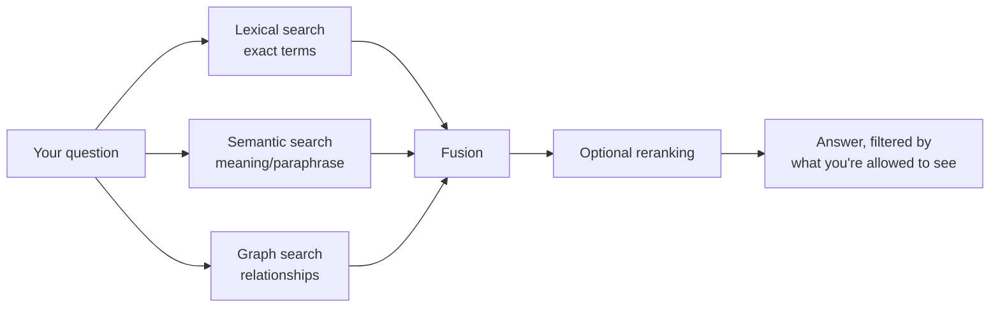
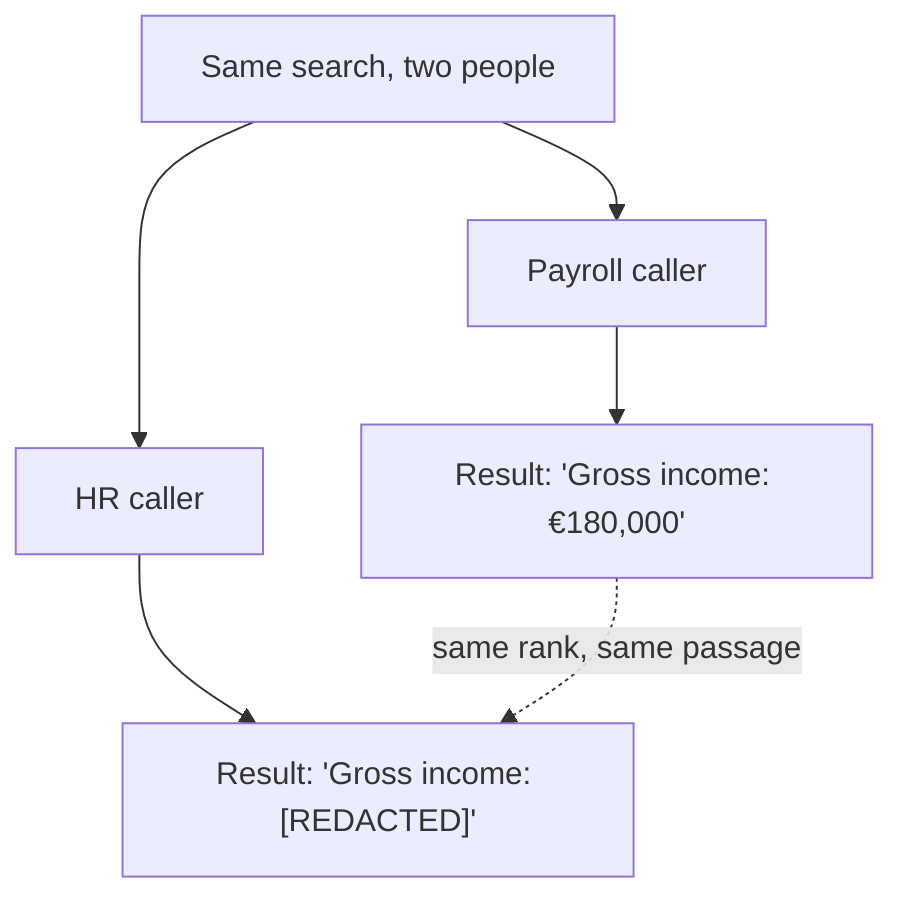

# Search: How Hybrid Search Works

**Audience:** anyone evaluating or using Synanton who wants to understand what happens between typing a question and getting an answer — no query DSL, no gRPC, no ranking math required.

## The short version

When you search Synanton, you're not running one search — you're running up to three, at once, against the same content, and then letting the results argue their way into a single ranked list:

1. A **keyword search** finds documents that contain the words you typed.
2. A **meaning search** finds documents that are *about* what you asked, even if they don't share a single word with your query.
3. A **relationship search** finds documents connected to your answer through facts the platform has already extracted — "who supplies whom," "which policy governs which contract."

No single one of these is "the real search" with the others bolted on for flavor. They're three different lenses on the same underlying content, and Synanton fuses their opinions into one ranked, access-controlled result set — typically in under 200 milliseconds.

## Why not just pick one?

Each approach has a blind spot the others cover.

| Approach | Good at | Blind spot |
|---|---|---|
| **Keyword (lexical)** | Exact terms, names, IDs, jargon a user typed correctly | Misses paraphrases — "end the agreement" won't match "terminate this contract" |
| **Meaning (vector/semantic)** | Paraphrase, synonym, conceptual similarity | Can miss an exact but rare term (a part number, a specific SSN-like ID) that isn't semantically distinctive |
| **Relationship (graph)** | "What's connected to what" — ownership, supply chains, governing policies | Doesn't rank by textual relevance at all; it answers a different kind of question |

A user asking *"which suppliers have contracts expiring soon, and what are the termination requirements?"* is really asking a graph question (find the suppliers), a keyword question (find contract clauses), and a meaning question (find clauses about termination that don't use the word "termination") — all in one sentence. Committing to one search technology means silently failing on the other two-thirds of that question.

## The three engines, briefly

**Lexical search** (powered by `synquest`, Synanton's Rust-based search kernel) works the way a librarian's index card catalog works: for every meaningful word, it keeps a list of exactly which passages contain it, plus how often and how prominently. This is the same family of technique used by traditional search engines (the ranking algorithm is BM25, if you want the name) — fast, precise, and excellent at exact terms, but blind to phrasing differences.

**Vector (semantic) search** turns each passage into a point in a high-dimensional space, positioned so that passages with similar *meaning* end up near each other — regardless of the specific words used. A query is turned into a point the same way, and the search finds the nearest neighbors. This is what lets "rules for ending an agreement" find a clause that says "either party may terminate this contract," even though the two sentences share almost no vocabulary.

**Graph search** (powered by `relix`) doesn't rank passages at all — it traverses facts. Every passage that mentions entities and relationships (companies, people, contracts, obligations) contributes nodes and edges to a knowledge graph, and a graph query walks that structure to answer "what is connected to what" — a question neither of the other two approaches can answer well, because relevance-ranking and graph-traversal are fundamentally different operations.

## How the results get combined

Lexical and semantic hits are combined through a technique called **Reciprocal Rank Fusion**: instead of trying to compare a BM25 score to a vector-similarity score directly (they're not the same kind of number, and comparing them naively produces nonsense), the platform looks at each engine's *rank order* — first place, second place, third place — and combines those ranks. A passage that lands in the top five of both lists outranks one that's first on only one list. This is why fusing two "different" scoring systems produces a coherent single ranking rather than an arbitrary blend.

Graph results, when relevant, seed a further expansion step: the top candidates from the lexical/semantic fusion become starting points for a graph traversal, which can pull in connected facts that neither text-based approach would have surfaced on its own — a supplier mentioned in a different document than the one containing the expiring contract, say.

After fusion (and optional graph expansion), an optional **reranking** step can take a second, more expensive pass over just the top candidates — a specialized model reads the actual query alongside each candidate passage and re-scores how well they answer it, which is a meaningfully different (and more accurate, if slower) judgment than any single-pass ranking. If the reranker is unavailable for any reason, Synanton returns the un-reranked results rather than failing the search — a reranker outage degrades ranking quality, never availability.

## Search never forgets who's asking

This is the part that makes Synanton's search meaningfully different from bolting a search engine onto a document store: **access control isn't a filter applied to results after the fact — it's built into the search itself, before any ranking happens.**

Concretely, when you search, the platform doesn't compute "all matches, then remove the ones you can't see." It computes "matches, restricted to what you can see" from the very first step — the same way a database query with a `WHERE` clause never even considers rows outside that clause, rather than fetching everything and throwing rows away afterward. This distinction matters more than it sounds: a naive post-filter can still leak information through side channels — how many total hits there were, which terms were statistically common — even while correctly hiding the actual sensitive content. Building the restriction in from the start closes that leak.

The practical effect: two people can run the identical search and get genuinely different, both-correct answers. A payroll employee searching "gross income" sees the real compensation figures in a matching passage. An HR employee running the exact same search sees the same passage, ranked the same way, but with the sensitive figure replaced by a redaction marker — a real, useful, non-zero result that still correctly withholds the number it isn't authorized to show. Neither person gets an error; neither person gets zero results just because *part* of a document is sensitive. [Security 101](security.md) covers exactly how that decision gets made.

## What happens when things aren't running at full strength

Search is designed to degrade gracefully rather than fail outright. If the GPU capacity behind semantic search is saturated or temporarily unavailable, the platform falls back to a smaller, CPU-friendly model rather than skipping semantic search altogether — and if even that isn't feasible, it proceeds with lexical-only results rather than returning an error. The response is always labeled when this happens (a warning flag, not a silent quality drop), because a platform that quietly gets worse without telling anyone is worse than one that's visibly degraded. The same philosophy applies to reranking: if it's unavailable, you get un-reranked results with a flag, not a failed search.

This matters operationally too — see [Troubleshooting 101](troubleshooting.md) for what a degraded-mode flag actually means when you see one, and when it's worth escalating versus just noting that the platform is temporarily running at reduced capability.

## A worked example

Suppose a user asks: *"What are our obligations if a vendor misses a delivery deadline?"*

- **Lexical search** finds passages containing "delivery," "deadline," "vendor," and close variants — including a clause that literally says "vendor shall notify buyer within 48 hours of an anticipated delay."
- **Semantic search** finds a clause that never uses the word "deadline" at all: "should the supplier fail to fulfill the agreed shipment schedule, the following remedies apply" — same concept, essentially no shared vocabulary with the query.
- **Graph search**, seeded from the vendor entity found in those clauses, surfaces a related fact from a *different* document: an amendment that changed the penalty terms for that same vendor relationship six months later.
- **Fusion** combines the two text-based results by rank, promoting whichever passage's overall standing (across both lists) is strongest, and the graph fact gets attached as supporting context rather than competing for a rank slot of its own.
- **Reranking**, if enabled, takes a final look at the fused top candidates with full knowledge of the exact question asked, and may reorder them if one passage answers the specific question ("what are our obligations") more directly than another that's merely topically related.
- Every returned passage is filtered, before all of the above, to only what this specific caller's classification and resource permissions allow — so if the penalty-terms amendment happens to live in a restricted contract folder this user can't access, it simply never enters the candidate set, regardless of how relevant it would otherwise be.

## Search across languages

Enterprise content is rarely monolingual, and lexical search has a historical weak spot here: Western tokenization (splitting on spaces and punctuation) doesn't work for languages like Chinese, Japanese, or Korean, which don't reliably use spaces to separate words at all. Rather than requiring a per-language dictionary (which needs constant maintenance as vocabulary changes), Synanton's lexical layer uses an overlapping-character technique for CJK text that doesn't need to know what a "word" is in that language to index it usefully. The practical effect: a mixed-language document set doesn't need separate index pipelines per language, and a search for a CJK term works the same way a search for an English term does, from the caller's point of view.

Vector search sidesteps the word-boundary problem entirely — the embedding model that turns a passage into a point in meaning-space is trained to place semantically similar text near each other regardless of language, which is part of why the two approaches complement rather than duplicate each other.

## Why searches feel instant even under load

Two techniques keep response times fast without sacrificing correctness:

- **Result caching.** A meaningful fraction of enterprise search traffic is repetitive — the same or very similar questions asked by different people who share the same effective permissions. Synanton caches synthesized answers keyed not just by the question, but by the *access mask* of who's allowed to see what — so a cache hit is only ever served to a caller whose permissions genuinely match the cached result's, never to someone who happens to ask a similar question with different entitlements. When it hits, it can skip the entire retrieval-and-synthesis pipeline; when it doesn't, the search runs fully as described above.
- **Cost and safety limits.** Every query carries a soft cap on how many candidate results it will consider before the platform starts trimming, and a hard cap beyond that where it stops outright rather than let a single unusually broad query monopolize shared infrastructure. This is invisible on a normal, well-scoped search and only becomes noticeable — as a "budget trimmed" warning rather than a silent truncation — on a query broad enough that trimming was inevitable anyway.

## Frequently asked questions

**Does a broader (more permissive) role always see more search results?**
Not necessarily more *hits* — a chunk containing only non-sensitive content looks identical to every caller regardless of role. A broader role sees more of the *content within* hits that do contain sensitive material (the unredacted figure instead of a placeholder), not additional documents that a narrower role can't find at all — unless the underlying resource-level permissions genuinely differ.

**Can I tell whether a result was reranked or came from cache?**
Yes — every response includes an execution trace describing which stages ran (fusion, graph expansion, reranking) and whether any stage fell back to a degraded path. This is exposed to operators and developers; it's not meant to be surfaced directly to an end user in a typical search UI.

**Why did my search return fewer results after a permissions change?**
If a resource-level grant or a classification-based grant was narrowed, previously visible content — or the unredacted version of it — can legitimately stop appearing, with no bug involved. See [Troubleshooting 101](troubleshooting.md) for how to tell that apart from an actual malfunction.

## Go Deeper

| Question | Document |
|---|---|
| What's the exact step-by-step query execution pipeline (compile, plan, execute, fuse, rerank)? | `docs/architecture/synanton-design-1.22.md` §7 (Query Flow) |
| How does GraphRAG combine vector retrieval with graph traversal? | `docs/architecture/synanton-design-1.22.md` §8 |
| How is access control compiled into the query instead of filtered after? | `docs/architecture/synanton-design-1.23.md` §3.3; [Security 101](security.md) |
| What does the reverse index / vector store / graph actually store, mechanically? | `docs/book/Ingestion and security processing guide.md`, Part IV |
| What are the search latency SLOs? | `docs/architecture/synanton-design-1.22.md` §7 ("SLOs") |
