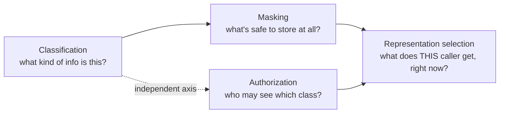
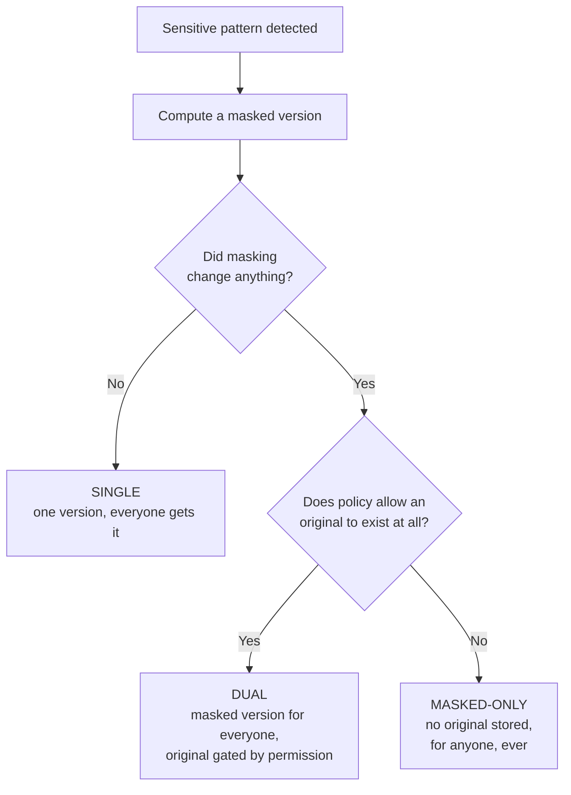

# Security: Classification, Masking, and Authorization

**Audience:** security officers, compliance teams, and product managers who need to understand how Synanton protects sensitive data — without reading detector regex or storage schemas.

## The problem in one sentence

A single enterprise document can contain information at wildly different sensitivity levels — an employee's identity, their salary, a paragraph of public policy — and different people are entitled to see different slices of it, and *who's entitled to what* can change at any moment without anyone re-processing the document. Synanton's security model exists to make that possible without either over-restricting (hiding safe content because it happened to sit near sensitive content) or under-restricting (leaking sensitive content because the system only reasoned about whole documents).

## Why "lock the whole document" doesn't work

Until recently, Synanton's access model — like most systems' — was **resource-centric**: permissions lived at the level of a space, project, folder, or document. That works fine as long as sensitivity is uniform within a document. It breaks the moment it isn't, and enterprise documents routinely aren't. Consider a single employee-record PDF:

- An identity section (name, address) — should essentially never be bulk-searchable.
- A contact section — HR should see it; most employees shouldn't.
- A compensation table — payroll should see it; HR shouldn't.

A resource-level model has exactly one lever for this entire document: grant it or don't. It cannot express "payroll may see the compensation table, but not the identity section, in the same file" — there's no unit inside the document for a permission to attach to. Synanton's answer is to move the unit of protection down from the whole document to the **chunk** — the same coherent, meaningful unit of content that [Ingestion 101](ingestion.md) explains gets created during document processing.

## Three separate questions, deliberately kept separate

The core design decision — and the one that makes the whole model reason about cleanly — is refusing to conflate three questions that are easy to blur together:

| Question | Mechanism | Answers |
|---|---|---|
| *What kind of information is this?* | **Classification** | `PUBLIC`, `PERSONAL`, `FINANCIAL`, or `RESTRICTED` — a label on the content itself |
| *Which literal values must never be stored in the clear?* | **Masking** | A decision about what representation of a chunk is safe to compute and keep at all |
| *Who is allowed to see which representation?* | **Authorization** | A grant, held by a person or role, resolved fresh every time someone asks |

Conflating these — treating "this is sensitive" and "you can't see it" as the same fact — either destroys information that legitimate users need, or leaks information that nobody should get. Keeping them separate is what lets the system say, correctly, "this chunk is financial information, this particular caller isn't authorized for the original figure, so give them a version that's still useful but omits the number" — a genuinely different, better answer than either "show everything" or "show nothing."

## How classification works

As content is processed, a set of deterministic checks — not a language model's best guess — scans each chunk for known patterns: a Social Security number format plus a checksum validation, a phone number pattern, an address matched against a gazetteer of place names, or a table whose headers match known financial vocabulary ("Gross income," "Federal tax," "Salary"). These checks are deliberately **auditable**: given the same input, they produce the same output every time, and a security reviewer can point at the exact rule that fired. Anything the checks aren't confident about gets routed to a human review queue rather than guessed at — the system would rather ask a person than silently mislabel content in either direction.

The result is a classification label attached to the chunk. That label describes the *content*, full stop — it says nothing yet about who can see it.

## The masking decision: three possible outcomes

Knowing a chunk is `FINANCIAL` doesn't, by itself, stop the literal salary figure inside it from ending up copied into a search index, a vector embedding, and a knowledge graph fact — three separate places a number could leak from if nothing else happened. Masking is the step that decides what's actually safe to compute and store, and it produces one of three outcomes:

- **Single.** The chunk was flagged `FINANCIAL` because it sits in a compensation section, say, but this particular sentence — "employees are eligible for the annual bonus program" — has no literal sensitive value in it. There's nothing to protect, so there's exactly one version, and everyone with ordinary access sees it. The classification label is retained for audit purposes, but it doesn't restrict anyone's view of this specific chunk.
- **Dual.** Masking genuinely changed something, and policy says an authorized-only original may exist for this class (the default for personal and financial information). Two versions are computed and stored: a masked one, available to everyone, and an original, gated by permission.
- **Masked-only.** Masking changed something, and policy says no original may ever be persisted for this class (the default for restricted information, like a Social Security number). Only the masked version is ever computed for storage — full stop. There is no "sufficiently trusted" tier that unlocks the original, because there is no original artifact anywhere to unlock. Not even a security officer with the broadest possible grant gets it, because it was never written down anywhere search-related to begin with.

That third case is worth sitting with, because intuition suggests "restricted" content just needs *stricter* permission requirements. It doesn't. Some content should never exist in a retrievable form at all, for anyone — and Synanton expresses that as a single policy setting rather than special-cased logic scattered through the codebase:

| Classification | Default masking policy |
|---|---|
| `RESTRICTED` (e.g. an SSN) | Masked-only — no original ever stored |
| `PERSONAL` | Dual — original exists, gated by permission |
| `FINANCIAL` | Dual — original exists, gated by permission |
| `PUBLIC` | No masking needed |

## Authorization: resolved fresh, every time

Separately from classification and masking, a grant system maps a person, group, or role to the classes they're allowed to search or view — payroll roles are granted `FINANCIAL`, HR roles are granted `PERSONAL`, and so on. This is completely independent of resource-level permissions (folder/project/document access); a caller's *effective* visibility is the combination of both:

> **effective visibility = resource-level access AND classification grant**

This separation is what makes permission changes cheap. If an audit team is later also granted access to financial classification, nothing about any already-stored content needs to change — only the rule that decides, at the moment someone searches, which representation they receive. Authorization is never baked into stored data; it's evaluated live, against whoever is actually asking right now, which is exactly why a permission revoked five minutes ago is honored on the very next search.

## What a search result actually looks like, concretely

The payoff of this whole model is that a sensitive chunk isn't a binary "visible or invisible" — it's request-shaped. A payroll employee and an HR employee can run the identical search and both get a real, ranked hit on the same passage:

- The payroll employee sees: *"Gross income: €180,000."*
- The HR employee sees: *"Gross income: [REDACTED:FINANCIAL]."*

Neither gets an error. Neither gets zero results just because part of the document was sensitive — which matters, because a system that just excludes any chunk containing anything sensitive would make broad swaths of ordinary business documents effectively unsearchable for most of the organization, which is its own kind of failure. This selection happens *before* the search even ranks results — not as an afterthought filter on an already-computed answer — which closes a subtler leak: even correctly hiding a value doesn't help if an unauthorized caller can still learn indirectly that a match exists, or how common a hidden term is, from the ranking statistics alone.

## The default is "no," not "yes"

If a chunk's classification is missing entirely — mid-migration, say, before a labeling pass has run against it — Synanton treats it as if it were the most restrictive category, until proven otherwise. The system is built to fail closed: when in doubt, nobody sees it, rather than everyone does. That's the only direction it's safe to be wrong in, and it's a deliberate, load-bearing default rather than an edge case someone forgot to handle.

## What can still change, and what that costs

Not every policy change requires re-processing every document — and knowing which kind of change you're making tells you what it will cost:

| Change | Example | Requires reprocessing stored content? |
|---|---|---|
| Who's authorized for a class | Audit team gains `FINANCIAL` access | **No** — only the query-time rule changes |
| What counts as a given class | A new detector pattern goes live | **Yes** — existing content needs re-labeling |
| What's masked vs. stored as dual | A class flips from "original allowed" to "masked-only" | **Yes** — the stored representation itself has changed |

The first case is the common one in practice — org charts and role assignments change far more often than the definition of "what counts as financial information" does — and it's the one the architecture optimizes for being instant and free.

## Where this doesn't (yet) reach

This model governs one axis: within a given organization's tenancy, who sees the original versus a redacted version of a chunk. A separate, **proposed** (not yet adopted) idea addresses a different axis — whether a sanitized version of a chunk could be safely shared *across* organizations for efficiency, so that the same boilerplate policy language appearing in a hundred customers' contracts doesn't need a hundred separate copies of the underlying computation. That's a genuinely different mechanism gated by a different policy, and it isn't implemented yet — it's mentioned here only so the terminology doesn't get confused if you encounter it elsewhere.

## Beyond the search index

Representation selection at the index and graph closes the main leak surface, but a handful of secondary channels touch sensitive content and need the same discipline:

- **Autocomplete / suggestions.** A naive suggestion feature could complete a term that only occurs in content a caller isn't authorized to see — effectively confirming the sensitive value exists, one keystroke at a time. Suggestions are filtered by the same classification rules as full search results.
- **Anomaly-detection logging.** The platform streams query text to an offline analysis pipeline for detecting unusual usage patterns. That stream is itself scanned for restricted patterns before it's retained, so query logging doesn't become its own quiet leak surface.
- **Highlighted snippets.** A search result's highlighted excerpt is rendered from whichever representation was actually selected for that caller — never from a richer version that happened to be sitting in the same underlying record. This sounds obvious until you consider how easy it would be, in a naive implementation, to build the highlight from the "full" text before applying any access check.

## Frequently asked questions

**If someone's access is revoked, how quickly does that take effect?**
Because authorization is resolved fresh on every request rather than baked into stored data, a revoked grant is honored on the very next search — there's no stale cache of "who could see what" to invalidate. If a search still appears to return restricted content shortly after an access change, that's a signal to escalate rather than assume it will resolve itself; see [Troubleshooting 101](troubleshooting.md).

**Does "masked-only" mean the sensitive information is gone entirely?**
No — it means it never exists in a retrievable form *within the search platform*. The original source document itself (the raw file, before any processing) is stored separately, behind its own, independent encryption and access controls, entirely outside the search plane's guarantees described in this guide. An organization that also needs the raw source document sanitized would configure that as a separate, deployment-level choice.

**Can a chunk belong to more than one classification at once?**
Yes — a passage can be tagged both `PERSONAL` and `FINANCIAL` if it contains both kinds of information (a name next to a salary figure, say). Masking and authorization apply per-classification, so the strictest applicable policy governs what's shown.

**Who decides what "financial" or "restricted" means for our organization?**
Classification rules are a platform-level policy, versioned and reviewed like any other configuration change — not something end users or even most administrators adjust directly. If your organization's definition of sensitive content differs from the defaults (a different set of regulated-industry categories, say), that's a conversation with the team that owns detector configuration, not a per-search setting.

**Is this the same thing as data loss prevention (DLP) software?**
It overlaps in goal but not in mechanism. General-purpose DLP tools typically scan content in transit or at rest after the fact. Synanton's model decides what's safe to store, in which form, *before* anything is committed to a searchable store — prevention at the point of creation, not detection after the fact.

## Go Deeper

| Question | Document |
|---|---|
| What are the exact detector patterns, and their known limitations? | `docs/architecture/synanton-design-1.23.md` §3.2 |
| How is the classification/masking model backward-compatible with pre-classification content? | `docs/architecture/synanton-design-1.23.md` §5 |
| How is representation selection compiled into the query, mechanically? | `docs/architecture/synanton-design-1.23.md` §3.3 |
| What's the full narrative walkthrough with more worked examples? | `docs/book/Ingestion and security processing guide.md`, Part III |
| What CI checks enforce these guarantees on every change? | `docs/architecture/synanton-design-1.23.md` §3.9 |
| What should I do if a security-related alert fires? | [Troubleshooting 101](troubleshooting.md) |
