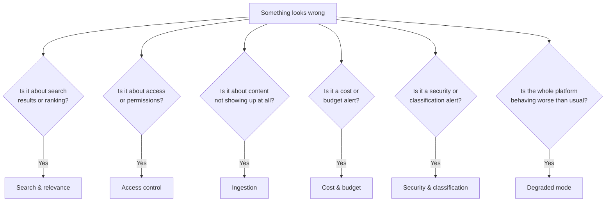

# Troubleshooting: Common Issues and When to Escalate

**Audience:** operators, support staff, and product managers who need a first-pass diagnosis — "is this expected, is this a real problem, and who do I actually need to page" — without reproducing runbook steps here.

This guide doesn't replace the operational runbooks under `docs/operations/runbooks/` — it's the layer above them: enough context to recognize which category a symptom falls into, whether it's likely expected behavior versus a genuine incident, and which team's runbook to reach for next.

## First question to ask: is this a flag, or a failure?

Before escalating anything, check whether the platform is *telling you* it's operating in a reduced-capability state. As [Search 101](search.md) and [Deployment 101](deployment.md) both describe, Synanton is built to degrade visibly rather than fail silently — a response carrying a degraded-mode flag, or an alert that names a fallback path being used, is often the *system working as designed*, not a bug. The distinction that matters: a flagged degradation usually means "quality is temporarily reduced, and it will self-heal when the underlying capacity issue clears." A silent wrong answer, or an error with no flag at all, is the thing that actually warrants urgent escalation.

## Access control and permissions

**Symptom:** a user reports they can't see content they should have access to, or — more concerning — still see content after their access was supposed to be revoked.

**Most likely cause:** permission changes propagate asynchronously in the standard isolation tier (see [Deployment 101](deployment.md)), which is normally near-instant but can occasionally stall if a grant gets stuck mid-propagation. This is different from a `HIGH_SECURITY`-tier tenant, where propagation is synchronous and a stuck grant would be a more serious signal.

**What to check first:** whether the affected tenant is `STANDARD` or `HIGH_SECURITY` tier, and how long ago the permission change was made — a few minutes' delay on `STANDARD` is often just propagation catching up, not a fault.

**Escalate to:** the team owning the organization/permissions store, via `docs/operations/runbooks/acl-stuck.md`, especially if the delay exceeds the platform's normal propagation SLA or affects a `HIGH_SECURITY` tenant at all.

## "Why did my search return zero results?"

**Symptom:** a search that should plausibly match something returns nothing, especially right after enabling or changing a classification-related setting.

**Walk through these, in order, before assuming something is broken:**

1. **Does the caller actually have resource-level access to where this content lives?** Classification-based filtering is layered *on top of* resource permissions, not instead of them — if the underlying folder/project access is missing, no classification grant will surface the content.
2. **Is the content genuinely unclassified yet?** Content that hasn't been through classification is treated as maximally restricted by default (see [Security 101](security.md)'s fail-closed default) — this is common right after a bulk ingest, before the classification pass has caught up, and it resolves itself once classification runs, not through any configuration change.
3. **Did a masking-only classification apply?** If the specific value someone searched for (an exact figure, say) was masked-only, no caller — regardless of permission level — will find it by searching for that literal value, because it was never stored anywhere in that form. This is expected behavior, not a bug, for classes like `RESTRICTED`.
4. **Is this actually a ranking issue, not an access issue?** A very low-relevance match can be trimmed by budget limits before it reaches the response. Try a more specific query before assuming access is the problem.

If none of the above explains it, that's the point to treat it as a genuine defect and escalate to search/gateway on-call rather than continuing to guess.

## Search quality and relevance degradation

**Symptom:** search results feel noticeably worse than usual — less relevant ranking, or a degraded-mode flag appearing on responses that didn't have one before.

**Most likely causes, roughly in order of frequency:** the reranking step falling back because the reranking service is unavailable (results still return, just without the final relevance pass); the semantic-search recall dropping below its normal baseline (an index or embedding-quality issue); or a cold-start cache miss causing a slower, less-optimized retrieval path temporarily.

**Escalate to:** search/`synquest` on-call for recall issues, gateway on-call for reranking fallback — check the response's execution trace (mentioned in [Search 101](search.md)) first, since it usually names exactly which stage degraded. Relevant runbooks: `synquest-recall.md`, `reranker-fallback.md`, `cold-rehydration.md`.

## Ingestion stuck or falling behind

**Symptom:** newly added or updated content isn't showing up in search after the time it normally takes, or an operator notices a growing backlog in the ingestion pipeline.

**Most likely causes:** a downstream dependency (a queue, a cache, an external content source) is slow or temporarily unavailable, causing the pipeline to back up; or, for a specific tenant, a fair-share throttling mechanism is intentionally slowing that tenant's ingestion rate to protect others sharing the same infrastructure — which looks like "stuck" but is actually working as designed under load.

**What to check first:** whether the slowdown is platform-wide (points to a shared dependency issue) or isolated to one tenant (points to fair-share throttling or a source-specific problem, like a flaky connection to that tenant's document source).

**Escalate to:** ingestion/`synflux` on-call. Relevant runbooks: `degraded-mode.md`, `router-backpressure.md`, `router-fairshare.md`.

## Cost and budget alerts

**Symptom:** an alert fires warning that a tenant is trending toward exhausting its usage budget, or requests are already being denied because a budget has been fully exhausted.

**Most likely cause:** a genuine usage spike (a large bulk ingestion job, an unusually high query volume), a forecasting miscalibration, or — less commonly — a runaway automated process making far more calls than intended.

**What this is *not* usually:** a platform malfunction. Budget alerts are a cost-governance feature working correctly, not a symptom of something broken — the response is a conversation about usage and limits, not a bug fix.

**Escalate to:** control-plane/billing on-call for the technical side (is the forecast accurate, is there a runaway process), and the account team for the tenant conversation if the usage itself is legitimate and the budget needs adjusting. Relevant runbooks: `budget-overrun.md` (early warning), `budget-exhausted.md` (already denying requests).

## Graph or relationship answers look stale

**Symptom:** a GraphRAG-style answer, or a relationship lookup, reflects organizational or content facts that are noticeably out of date compared to what's in the primary stores.

**Most likely cause:** the graph's materialized view of the organization/permissions structure lags behind the source of truth — normally by a small, bounded amount, but occasionally further if the projection pipeline itself is behind.

**Escalate to:** graph (`relix`) on-call. Relevant runbooks: `topology-projection.md`, `mgv-lag.md`.

## Security or classification alerts firing

**Symptom:** an alert indicates that restricted content was detected somewhere it shouldn't be, or that the classification pipeline's error rate has spiked.

**Why this category gets treated differently from the others:** unlike most alerts on this page, an alert indicating restricted content reached an index it shouldn't have is a "this should never happen" signal — see [Security 101](security.md)'s explanation of why masked-only content is designed to never exist in a retrievable form in the first place. It deserves immediate, high-priority escalation rather than a wait-and-see approach, precisely because the whole design of the classification model assumes this alert stays silent.

A rising classification-error rate (as opposed to a confirmed leak) is a different, lower-urgency signal — it usually means detector confidence is degrading against some new content pattern, which is a tuning conversation, not an active incident.

**Escalate to:** security/compliance on-call immediately for any confirmed restricted-content detection; the data-classification team for elevated error rates. Relevant runbook: `sanitization.md`.

## Platform-wide degraded mode

**Symptom:** multiple, seemingly unrelated symptoms all show up together — reduced search quality, disabled answer synthesis, slower ingestion — often with an explicit degraded-mode indicator visible in metrics or response headers.

**Most likely cause:** as [Deployment 101](deployment.md) describes, the GPU execution plane is saturated or unavailable, and the platform has automatically shifted into a reduced-capability posture rather than failing outright. This is usually self-resolving once GPU capacity is restored, with previously-degraded content automatically upgraded in the background.

**When it's worth escalating rather than waiting:** if the degraded window is running significantly longer than is typical, or if lexical-only search itself (the baseline that's supposed to keep working through any GPU-side issue) is also affected — that combination suggests something beyond the expected degraded-mode fallback.

**Escalate to:** gateway/platform SRE on-call. Relevant runbook: `degraded-mode.md`.

## AI agent / integration access issues

**Symptom:** an AI agent or automated integration using Synanton as a tool (through its MCP or agent-to-agent interface) starts getting scope-denied errors, or sessions require re-authentication more often than expected.

**Most likely cause:** the agent is requesting a permission scope it was never granted (a configuration mismatch on the integration side, usually), or a session revalidation step is running as designed — agent sessions are deliberately re-checked against current permissions on a schedule, rather than trusted indefinitely once established, precisely so a revoked grant can't be worked around by an agent holding an old session open.

**Escalate to:** the graph/MCP bridge on-call for revalidation-timing issues; the integration owner first for scope-denied errors, since those are frequently a configuration issue on the calling side rather than a platform fault. Relevant runbooks: `mcp-revalidation.md`, `mcp-scope.md`.

## Unusual administrative or support activity

**Symptom:** a spike in destructive administrative operations, authentication failures against internal tooling, or an unusually high rate of support staff acting on a customer's behalf.

**Why this matters even when nothing else looks broken:** this category isn't about the platform malfunctioning — it's about catching a compromised credential, a misbehaving automation script, or an overused support process before it becomes a real incident. Treat any unexplained spike here as worth a look even if no user has reported a problem.

**Escalate to:** security incident response, with support leadership looped in for anything involving "acting on behalf of a customer" patterns. Relevant runbooks: `helper-destructive.md`, `helper-auth.md`, `support-admin-review.md`.

## What to gather before you escalate

A first responder can save real time downstream by capturing a few things before handing off:

- **Tenant and isolation tier.** `STANDARD` vs `HIGH_SECURITY` changes which propagation and caching assumptions apply, as covered in [Deployment 101](deployment.md).
- **Whether a degraded-mode flag was present** on the affected responses, and for how long the condition has been observed — a five-minute blip and a two-hour outage point to very different causes even with identical symptoms.
- **Whether the issue is reproducible** with the same query/action, or was a one-off — a one-off is much more likely to be transient infrastructure noise than a design-level bug.
- **What changed recently** — a permission change, a new classification policy, a deployment — in the window before the symptom appeared. Most of the categories above trace back to *something* that changed, even when the symptom looks unrelated to that change at first glance.

## A quick reference table

| Symptom category | Likely cause | First escalation point |
|---|---|---|
| Access not taking effect (or not revoking) | Propagation delay | Permissions/`topology` on-call — `acl-stuck.md` |
| Zero search results | Missing resource access, unclassified content, or masked-only value | Walk the checklist above before escalating |
| Ranking/relevance feels worse | Reranker fallback or recall drop | Search/gateway on-call — `synquest-recall.md`, `reranker-fallback.md` |
| Content missing after ingest | Downstream slowness or fair-share throttling | Ingestion on-call — `router-backpressure.md`, `router-fairshare.md` |
| Budget alert | Usage spike or forecast miscalibration | Control-plane/billing, then account team — `budget-overrun.md`, `budget-exhausted.md` |
| Stale graph/relationship answers | Projection lag | Graph on-call — `topology-projection.md`, `mgv-lag.md` |
| Restricted content detected in an index | Confirmed leak — urgent | Security on-call immediately — `sanitization.md` |
| Multiple symptoms together, degraded flags present | GPU plane saturation | Platform SRE on-call — `degraded-mode.md` |

## Go Deeper

| Question | Document |
|---|---|
| Full operational runbook catalogue | `docs/operations/runbooks/` |
| Metrics, alerts, and dashboard conventions | `docs/operations/observability-guide.md` |
| Disaster recovery playbooks | `docs/operations/dr/` |
| Why classification and masking work the way they do | [Security 101](security.md) |
| Why degraded mode exists and what it covers | [Deployment 101](deployment.md) |
| The exact CI checks that guard the security guarantees mentioned above | `docs/architecture/synanton-design-1.23.md` §3.9 |
