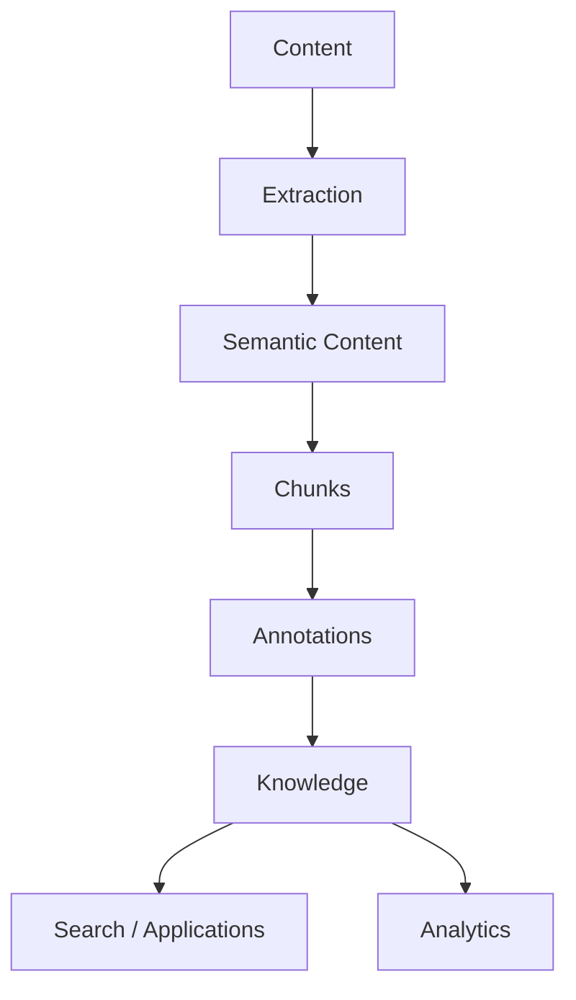

# Synanton

**Enterprise knowledge infrastructure for heterogeneous content.**

Synanton transforms documents, images, audio, video and enterprise records into structured, annotated,
connected and measurable knowledge.

> **Extract once. Annotate flexibly. Connect knowledge. Search precisely. Recalculate efficiently. Measure
> continuously.**

## What is Synanton?

Synanton is a programmable enterprise knowledge platform for transforming heterogeneous information into
structured, annotated and connected knowledge that can be searched, related, continuously recalculated and
measured.



Synanton is **not primarily** a chatbot, a vector database, a document parser, a speech analytics system, a
search engine, an LLM wrapper, or a reporting database. Those are components, integrations or applications
*enabled* by the platform — not what the platform is.

The central architectural promise:

> **Synanton transforms heterogeneous enterprise content into structured, annotated, connected and
> measurable knowledge.**

## Where to go next

<div class="grid cards" markdown>

- **New to Synanton?**

    Start with the [Getting Started overview](getting-started/overview.md), then walk through
    [how data flows through Synanton](getting-started/architecture-overview.md) end to end.

- **Want the architectural story?**

    [Concepts](concepts/synanton.md) explains what Synanton is without implementation detail —
    content model, chunks, annotations, security, search, recalculation.

- **Evaluating for a specific scenario?**

    [Use Cases](use-cases/overview.md) shows the same primitives applied to document search,
    conversation intelligence, customer support and more.

- **Building or operating the platform?**

    [Architecture](architecture/overview.md) and [Guides](guides/index.md) go deep on how each
    plane works, what changes it, and how it's secured and recalculated.

</div>

## The hero tutorial

The single tutorial that demonstrates nearly the entire architecture is
[Build a Multimodal Support Knowledge System](use-cases/multimodal-support.md): one support ticket, five
representations (email, PDF invoice, screenshot, audio call, agent notes), ingested, extracted, chunked,
classified, annotated, connected, indexed, searched, and measured — then recalculated when a rule changes.

## Documentation layers

Every reader can stop at the layer that answers their question:

```text
Introduction → Concepts → Use Cases → Architecture → Analytics → Guides/Integrations → Reference/Design
```

A business reader typically needs Introduction → Concepts → Use Cases → Analytics overview. An architect
continues into Architecture → Security → Recalculation → Analytics → Contracts. A developer continues into
Guides → Integrations → Reference.

See [Documentation Governance](design/index.md) for how conceptual truth, architectural truth and
implementation truth relate to each other, and where each lives.
