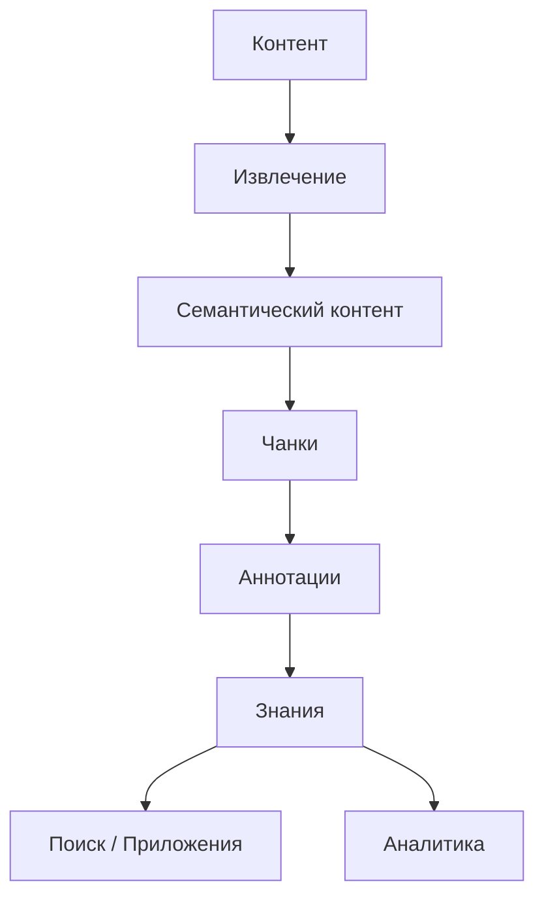

# Synanton

**Инфраструктура корпоративных знаний для неоднородного контента.**

Synanton превращает документы, изображения, аудио, видео и корпоративные записи в структурированные,
аннотированные, связанные и измеримые знания.

> **Извлекайте один раз. Аннотируйте гибко. Связывайте знания. Ищите точно. Пересчитывайте эффективно.
> Измеряйте непрерывно.**

## Что такое Synanton?

Synanton — программируемая платформа корпоративных знаний для превращения неоднородной информации в
структурированные, аннотированные и связанные знания, которые можно искать, связывать, непрерывно
пересчитывать и измерять.



Synanton **не является в первую очередь** чат-ботом, векторной базой данных, парсером документов, системой
речевой аналитики, поисковой системой, обёрткой над LLM или отчётной базой данных. Это компоненты,
интеграции или приложения, которые платформа *делает возможными*, — а не то, что представляет собой сама
платформа.

Центральное архитектурное обещание:

> **Synanton превращает неоднородный корпоративный контент в структурированные, аннотированные, связанные
> и измеримые знания.**

## Куда двигаться дальше

<div class="grid cards" markdown>

- **Впервые знакомитесь с Synanton?**

    Начните с [обзора Getting Started](getting-started/overview.ru.md), затем пройдите
    [путь данных через Synanton](getting-started/architecture-overview.ru.md) от начала до конца.

- **Нужна архитектурная история?**

    [Концепции](concepts/synanton.ru.md) объясняют, что такое Synanton, без деталей реализации —
    модель контента, чанки, аннотации, безопасность, поиск, пересчёт.

- **Оцениваете платформу для конкретного сценария?**

    [Сценарии использования](use-cases/overview.md) показывают те же примитивы на примерах поиска
    документов, анализа разговоров, поддержки клиентов и других задач.

- **Разрабатываете или эксплуатируете платформу?**

    [Архитектура](architecture/overview.ru.md) и [Руководства](guides/index.md) подробно описывают, как
    работает каждый уровень, что на него влияет и как он защищён и пересчитывается.

</div>

## Ключевой обучающий сценарий

Единственный туториал, который демонстрирует почти всю архитектуру целиком, —
[Построение мультимодальной системы знаний поддержки](use-cases/multimodal-support.md): один тикет
поддержки, пять представлений (письмо, PDF-счёт, скриншот, звонок, заметки агента), — принят, извлечён,
разбит на чанки, классифицирован, аннотирован, связан, проиндексирован, найден и измерен, а затем пересчитан
при изменении правила.

## Уровни документации

Каждый читатель может остановиться на том уровне, который отвечает на его вопрос:

```text
Введение → Концепции → Сценарии использования → Архитектура → Аналитика → Руководства/Интеграции → Справочник/Дизайн
```

Бизнес-читателю, как правило, достаточно пути Введение → Концепции → Сценарии использования → Обзор
аналитики. Архитектор продолжает в Архитектуру → Безопасность → Пересчёт → Аналитику → Контракты.
Разработчик продолжает в Руководства → Интеграции → Справочник.

О том, как соотносятся концептуальная, архитектурная и имплементационная истины и где живёт каждая из них,
см. [Управление документацией](design/index.md).
